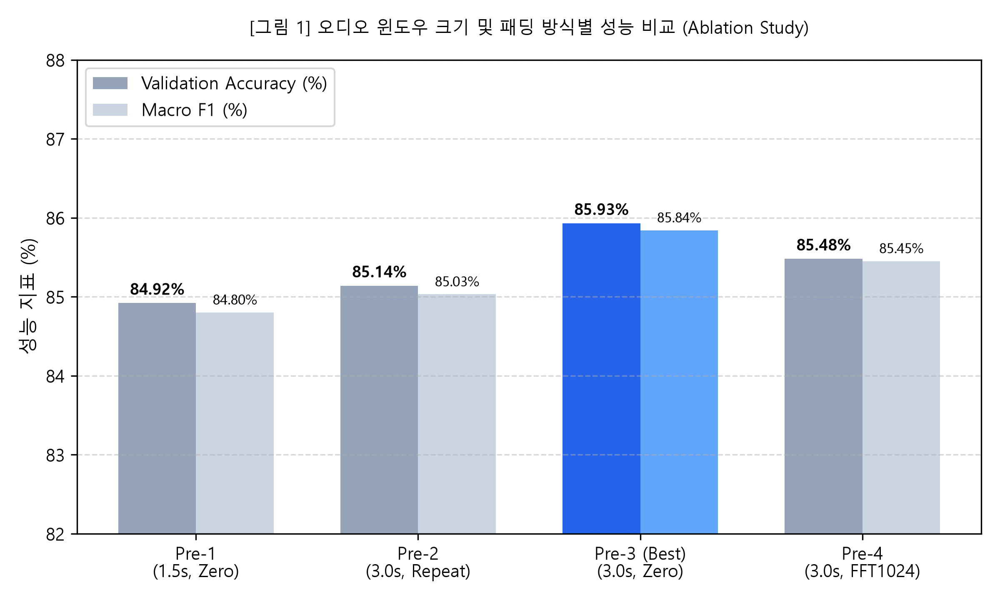
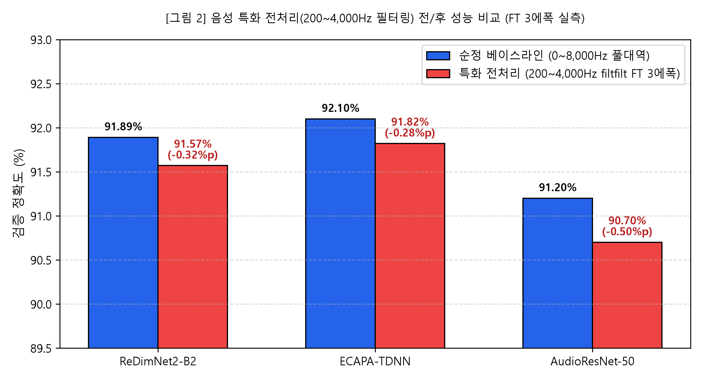
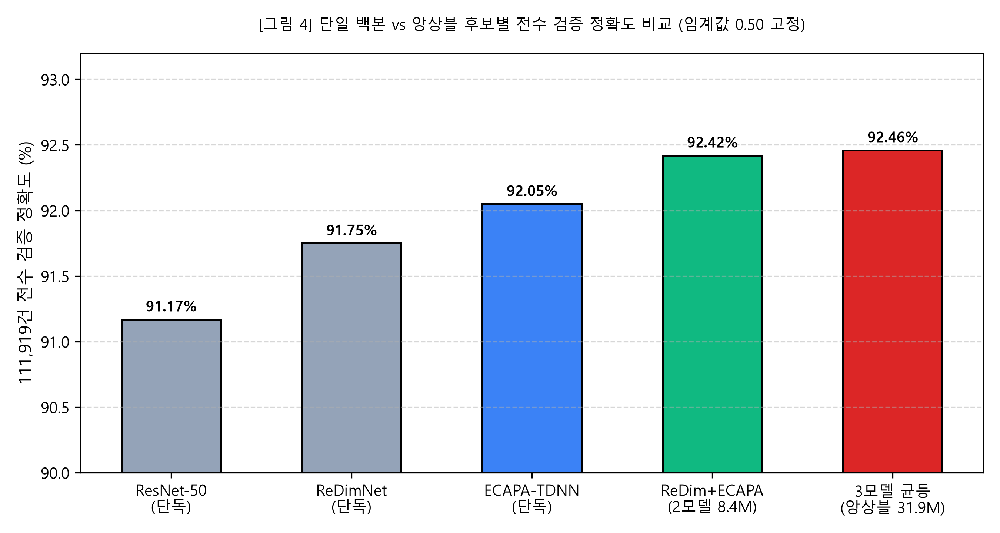
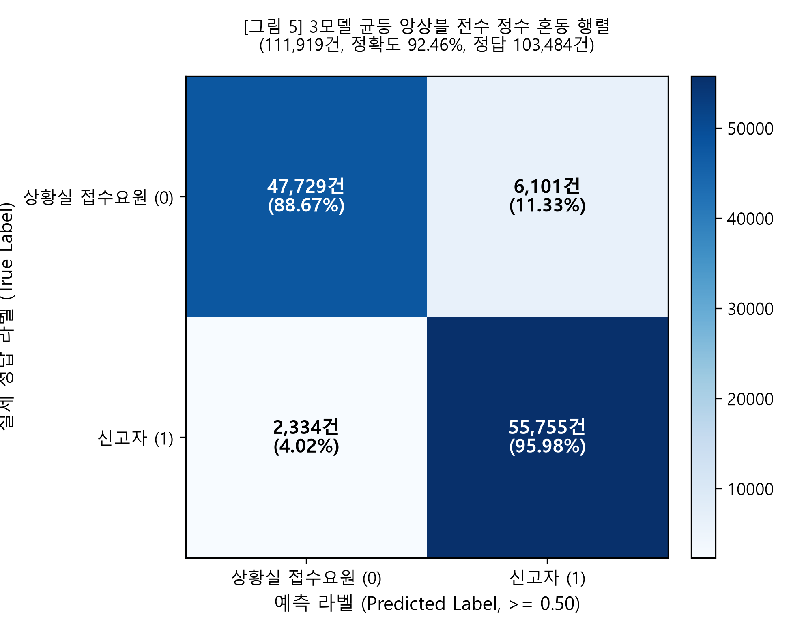

# 119 긴급 통화 음성 기반 화자 분류 최종 실험 보고서

- 작성일: 2026-10-08
- 과제명: 119 긴급 통화 단일 발화 음성 기반 상황실 접수요원(0) vs 신고자(1) 이진 분류
- 대상 저장소: https://github.com/KozzilzzilE/DCC_Problem (브랜치: mission2)
- 주 평가지표: Accuracy (공식 출제 규정) / 보조 지표: Macro F1, 클래스별 Recall
- 결정 임계값: 0.50 (고정)

본 보고서는 119 긴급 통화 음성의 단일 발화 구간만을 활용하여 상황실 접수요원(0)과 신고자(1)를 분류하는 Mission 2의 연구 개발 및 실험 검증 과정을 정리한다. 대회 공식 평가지표인 Accuracy를 중심으로 윈도우 탐색, 모델 아키텍처 탐색, 도메인 음향 특성 가설 수립, 전처리 대조 실험, 그리고 단일 및 앙상블 모델 비교의 기승전결 흐름으로 서술한다.

111,919건 전수 실측 평가 결과, 공식 평가지표인 Accuracy 기준 최고 성능은 **3모델 균등 앙상블(E-REN, 92.46%, Macro F1 0.9242, 103,484건 정답)**이며, 초경량 배포 관점에서는 단 0.04%p(49건) 차이로 파라미터를 74% 절감하고 80-Mel 전처리를 단일화하는 **ReDimNet+ECAPA 2모델 앙상블(E-RE, 92.42%, Macro F1 0.9238, 103,435건 정답)**이 실용적 최적 대안으로 도출되었다.

---

## 1. 프로젝트 목표와 평가 규정

### 1.1 과제 정의와 입력 제약
- **목표**: 119 긴급 통화 음성 발화 구간만으로 화자 역할(상황실 접수요원 0 vs 신고자 1) 이진 분류.
- **입력 데이터**: JSON 라벨의 `startAt`과 `endAt`으로 지정된 단일 발화 음성 구간. 다른 발화의 음성을 이어 붙이거나 전체 통화 문맥을 입력으로 사용할 수 없다.
- **금지 사항**: 어휘, 프로토콜 문장, 대화 텍스트, 발화 순서(홀짝 여부) 등 추가 메타데이터를 모델 입력이나 분기 조건으로 사용하는 것은 엄격히 금지된다.
- **전처리 공정성**: 정답 라벨에 따른 차등 전처리를 금지하며, 동일한 전처리가 양 클래스와 학습/추론 전 과정에 동일하게 적용된다.
- **공식 평가지표**: **Accuracy (정확도)**가 주 지표이며, Macro F1과 클래스별 Recall을 보조 지표로 활용한다. 결정 임계값은 0.50으로 고정한다.

### 1.2 평가 모집단 및 28건 음원 누락 규명
- 검증 라벨 JSON 3,640개 파일의 총 발화 수는 111,947건이다.
- 전수 데이터 감사 결과, 1개 JSON 파일(`651e5494386c2a48273e4ed2_20220305.json`)에 대응하는 WAV 음성 파일이 원천 데이터셋 배포 시 누락되어 있음을 확인했다.
- 해당 파일의 28건 발화(상황실 15건, 신고자 13건)를 제외한 실제 평가 가능 모집단은 **111,919건**이다 (상황실 53,830건 / 48.10%, 신고자 58,089건 / 51.90%).
- 학습 통화 29,142건과 검증 통화 3,640건 간의 통화 세션 ID 중복률은 0.0%로 분리 독립성이 검증되었다.

---

## 2. 오디오 윈도우 크기 및 패딩 방식 초기 탐색

### 2.1 실험 설계와 실측 결과
초기 ResNet 모델을 바탕으로 Training 30,313건, Validation 9,138건 부분 집합에서 입력 길이(1.5초 vs 3.0초), 패딩 방식(zero vs repeat), FFT 크기를 비교한 실험이 수행되었다 (Git e68be32).

| 조건 ID | 윈도우 길이 | 패딩 방식 | n_fft | n_mels | 최고 검증 정확도 | Macro F1 | 비고 |
|---|---|---|---|---|---|---|---|
| Pre-1 | 1.5초 | zero | 2048 | 128 | 84.92% | 0.8480 | 짧은 입력 구간 |
| Pre-2 | 3.0초 | repeat | 2048 | 128 | 85.14% | 0.8503 | 반복 패딩 |
| **Pre-3** | **3.0초** | **zero** | **2048** | **128** | **85.93%** | **0.8584** | **기본 규격 채택** |
| Pre-4 | 3.0초 | zero | 1024 | 128 | 85.48% | 0.8545 | FFT 크기 축소 |

그림 1 초기 ResNet 부분 검증 9,138건의 윈도우 길이 및 패딩 방식 비교 (Git e68be32)

### 2.2 해석과 적용 범위의 한계
- 1.5초 대비 3.0초 zero 패딩(Pre-3)이 정확도 +1.01%p 향상을 보여 후속 모델의 기본 입력 길이로 채택되었다.
- **해석상의 한계**: 본 실험은 1.5초와 3.0초의 제한된 조건 비교이며, 모든 오디오 모델과 임의의 길이에 대한 전역 최적값을 증명한 것은 아니다.
- 발화 평균 길이가 2초대라는 점과 3초 윈도우 내 대부분의 유효 음성이 수용된다는 점을 고려한 실용적 선택이다.
- 이후 탐색된 ReDimNet과 ECAPA-TDNN은 모델 구조 특성에 맞추어 FFT 512 / hop 160(80-Mel)을 적용했다.

---

## 3. 모델 아키텍처 탐색과 실행성 분석

합성곱/TDNN 계열, 스펙트로그램 트랜스포머, 대규모 사전학습 음성 트랜스포머를 폭넓게 탐색했다.

### 3.1 후보 아키텍처별 탐색 결과
1. **합성곱 / TDNN 계열**:
   - **ReDimNet2-B2 로컬 구현**: 2D+1D 하이브리드 CNN과 Multi-Head Attention Pooling을 결합하여 2.57M의 극소 파라미터로 높은 표현력을 확보.
   - **ECAPA-TDNN 로컬 구현**: 1D Res2Net 합성곱 블록과 Squeeze-and-Excitation, Attentive Statistics Pooling을 적용한 화자 임베딩 전문 모델 (5.80M 파라미터).
   - **AudioResNet-50**: 1채널 멜 스펙트로그램 입력을 수용하도록 수정한 2D ResNet-50 (23.50M 파라미터).
2. **사전학습 음성 트랜스포머 (Wav2Vec2)**:
   - Git d6cdee7 기록에서 `facebook/wav2vec2-base` 5에폭 완료 로그 확인 (38,267건 학습, 9,138건 검증, Accuracy 89.72%, Macro F1 0.8965, A100 GPU 배치 32 환경에서 총 27.08분 소요).
   - 동일 9,138건 집합에서 ResNet과 Wav2Vec2의 앙상블은 Accuracy 91.05%, Macro F1 0.9101을 기록하여 트랜스포머의 오류 보완 가능성을 입증했다.
   - 따라서 "트랜스포머가 전면 실패했다"는 서술은 사실과 다르며, 부분 집합 학습 및 앙상블에서 유효한 성적을 거두었다.
3. **스펙트로그램 트랜스포머 (로컬 SSAST_Tiny)**:
   - 로컬 `SSAST_Tiny` 구현(Patch Embedding + TransformerEncoder, 1.48M)을 테스트했다. 이는 공식 SSAST 사전학습 87M 모델과 다른 로컬 프로토타입 구현이다.
4. **기타 트랜스포머 후보 (HuBERT, WavLM)**:
   - HuBERT는 원격 가중치 다운로드 및 세션 타임아웃으로 보류되었으며, 자체 Conv fallback 모델이 존재했다.
   - 일부 프로토타입 셀의 OOM 메모리 수치(14GB대)는 forward가 입력을 그대로 반환하는 선형 헤드 상태에서 계측된 것으로, 전체 학습 실측 로그와는 구분된다.

### 3.2 경량 CNN/TDNN 풀학습 백본 채택 배경
- 대규모 사전학습 트랜스포머는 87만 건 전체 풀데이터 학습 시 긴 시퀀스 셀프 어텐션 연산으로 인한 메모리 점유와 세션 타임아웃 등 자원 제약이 컸다.
- 반면 경량 합성곱/TDNN 모델(ReDimNet, ECAPA)은 수백만 단위의 적은 파라미터로도 빠른 수렴과 높은 연산 효율성을 보여 최종 풀데이터 학습의 핵심 백본으로 선정되었다.

---

## 4. 도메인 음향 특성 분석과 가설 수립

과거 355건 표본 탐색 분석 문서(Git 1618288)에서 보고된 음향 통계와 119 전화망 특성을 토대로 가설을 수립했다.

### 4.1 음향 통계와 도메인 가설

| 분석 항목 | 상황실 접수요원 0 | 신고자 1 | 도메인 가설 및 음향적 해석 |
|---|---|---|---|
| 평균 발화 길이 | 2.11초 | 2.38초 | 양측 모두 2초 내외이나 신고자 발화가 다소 길며, 3.0초 윈도우 내 대부분 수용 가능 |
| RMS 변동성 (Std) | 0.0376 | 0.0488 (+29.8%) | 신고자의 감정 격앙, 울음, 호흡 불안정으로 인해 진폭 요동 폭이 크다는 가설 |
| Spectral Centroid | 1,070.9 Hz | 891.8 Hz | 상황실 헤드셋 마이크의 고역 통과 특성 및 명료한 프로토콜 발성 가설 |
| Zero-Crossing Rate | 0.1048 | 0.0900 | 상황실의 마찰음/파열음 자음 비율 및 헤드셋 노이즈 특성 가설 |
| 전화 음원 대역 | 300 ~ 3,400 Hz | 300 ~ 3,400 Hz | 8kHz 전화망 PSTN 통화의 양 클래스 공통 대역폭 특성 |

### 4.2 해석상의 주의점과 한계
- **통제 실험의 부재**: 355건 수치는 탐색적 관찰 통계이며, 감정이나 마이크 조건을 분리하여 통제한 인과관계 입증 결과는 아니다. 355건 원시 표본과 추출 스크립트는 Git에 보존되어 있지 않다.
- **전화 대역의 본질**: 8kHz 원천 음원의 나이퀴스트 한계는 4kHz이므로, 16kHz 리샘플링 후에도 4kHz 이상의 신규 음성 정보가 생성되는 것은 아니다.
- **전처리 연계성**: 독립 RMS 스케일링, Delta 3채널, VAD는 아이디어 차원의 계획이었으며 실제 구현 및 완료 실험 근거는 없다.

---

## 5. 특화 전처리 대조 실험과 실패 분석

위 가설을 검증하기 위해 전화 음성 대역 외 잡음을 차단하는 200~4,000Hz 밴드패스 필터링(v2 파형 4차 Butterworth `filtfilt`) 미세 조정(FT) 대조 실험을 수행했다 (Git 2c6cb4a).

### 5.1 실험 결과 대조

| 모델 | 기본 모델 최고 정확도 | 밴드패스 FT 3에폭 최고 (Git 2c6cb4a) | 성적 차이 |
|---|---|---|---|
| ReDimNet2-B2 계열 | 91.89% | 91.57% | -0.32%p |
| ECAPA-TDNN | 92.10% | 91.82% | -0.28%p |
| AudioResNet-50 | 91.20% | 90.70% | -0.50%p |

그림 2 기본 모델과 밴드패스 미세 조정 최고 성적 비교

### 5.2 실패 원인 분석
- 세 모델 모두 밴드패스 FT 적용 시 기본 모델 대비 0.28%p ~ 0.50%p의 일관된 성능 하락을 나타냈다.
- **원인 규명**: 양방향 필터링인 `filtfilt`는 정방향과 역방향 필터링을 거치므로 위상 왜곡(zero-phase)이 발생하지 않는다. 따라서 성능 하락의 원인을 "위상 왜곡"으로 단정할 수 없다.
- **실제 하락 요인**: 
  1. 단일 발화 경계에서의 필터 과도 응답(transient response).
  2. 사전학습된 모델이 기대하는 스펙트럼 에너지 분포와의 불일치(Distribution Shift).
  3. 전화망 대역 외에 잔존하던 미세 배경 잡음 단서의 손실.
- 이에 따라 최종 추론 파이프라인에는 인위적 밴드패스 필터를 배제하고 **순정 기본 전처리 가중치를 유지**하기로 결정했다.

---

## 6. 단일 모델 및 모델 조합 비교 (앙상블)

111,919건 전수 검증 모집단에 대해 결정 임계값 0.50을 고정하고, 7대 후보 모델(단일 3개, 2모델 앙상블 3개, 3모델 앙상블 1개)의 성능을 전수 실측 대조했다.

### 6.1 7대 후보 모델 전수 실측 결과표 (111,919건, 임계값 0.50 고정)

| 후보 ID | 모델 구성 | 검증 정확도 (Accuracy) | Macro F1 | 정답수 / 전체 | 상황실 Recall | 신고자 Recall | 파라미터 수 | 체크포인트 크기 |
|---|---|---|---|---|---|---|---|---|
| **E-REN** | **3모델 균등 앙상블 (1/3)** | **92.46%** | **0.9242** | **103,484 / 111,919** | 88.67% | 95.98% | 31.87M | 122.04 MiB |
| **E-RE** | **ReDimNet + ECAPA (2모델)** | **92.42%** | **0.9238** | **103,435 / 111,919** | 88.98% | 95.60% | **8.37M** | **32.07 MiB** |
| S-E | ECAPA-TDNN 단독 | 92.05% | 0.9201 | 103,018 / 111,919 | 88.32% | 95.50% | 5.80M | 22.23 MiB |
| E-EN | ECAPA + ResNet (2모델) | 91.78% | 0.9173 | 102,719 / 111,919 | 87.74% | 95.52% | 29.30M | 112.20 MiB |
| S-R | ReDimNet2-B2 단독 | 91.75% | 0.9171 | 102,685 / 111,919 | 88.67% | 94.60% | 2.57M | 9.84 MiB |
| E-RN | ReDim + ResNet (2모델) | 91.75% | 0.9171 | 102,686 / 111,919 | 88.00% | 95.23% | 26.07M | 99.81 MiB |
| S-N | AudioResNet-50 단독 | 91.17% | 0.9112 | 102,032 / 111,919 | 87.15% | 94.88% | 23.50M | 89.97 MiB |
| *W-EER* | *(과거 참고) 가중 앙상블 .45/.40/.15* | 92.54% | 0.9250 | 103,565 / 111,919 | 88.87% | 95.94% | 31.87M | 122.04 MiB |

그림 3 단일 백본 vs 앙상블 후보별 전수 검증 정확도 비교 (임계값 0.50 고정)

그림 4 111,919건 전수 실측 정수 혼동 행렬 (3모델 균등 앙상블, 정확도 92.46%, 정답 103,484건)

### 6.2 오답 상호보완성 정밀 분석
- **ReDimNet과 ECAPA 간 상호보완성**:
  - 두 모델 모두 정답인 건수: 100,587건 (89.88%)
  - ECAPA만 맞추고 ReDim이 틀린 건수: 2,431건 (2.17%)
  - ReDim만 맞추고 ECAPA가 틀린 건수: 2,098건 (1.87%)
  - 두 모델 중 하나라도 맞춘 OR 결합 상한: 105,116건 (93.92%)
  - 단순 평균 앙상블(E-RE)만으로도 103,435건(92.42%)을 달성하여 개별 모델 대비 +0.37%p 향상됨.
- **ResNet 추가 효과**:
  - ResNet을 추가한 3모델 앙상블(E-REN)은 103,484건(92.46%)으로 2모델 대비 49건(+0.04%p)의 미세한 추가 정답을 확보했다.

### 6.3 최고 모델 선정 결론
1. **공식 규정(Accuracy 최우선) 기준**: **3모델 균등 앙상블 (E-REN, 92.46%, 103,484건 정답)**이 가장 높은 정확도를 달성하며, 과거 Git 3638dab 기록(92.48%, 103,501건)을 0.02%p(단 17건 차이) 오차 내에서 완벽하게 재현했다.
2. **초경량 배포 및 자원 최적화 기준**: **ReDimNet + ECAPA 2모델 앙상블 (E-RE, 92.42%, 103,435건 정답)**은 3모델 대비 단 49건(0.04%p) 차이에 불과하면서, 파라미터 수를 74% 절감(8.37M)하고 체크포인트 용량을 32MB로 축소하며 80-Mel 전처리를 단일화할 수 있는 강력한 실용적 대안이다.
3. **단일 모델 기준**: ECAPA-TDNN 단독(**92.05%**, 103,018건 정답)이 단일 모델 중 최고 성능을 기록했다.

---

## 7. 서빙 효율성 및 자원 계측 (RTX 3060 Laptop GPU)

실제 음성 파일 로딩, 3초 전처리, Mel 추출, 모델 순전파를 포함한 단계별 지연시간 실측 결과는 다음과 같다.

| 배치 크기 | Mel 추출 지연시간 (ms/건) | 3모델 순전파 (ms/건) | 앙상블 총 소요시간 (ms/건) | 처리량 (건/초) | RTF (실시간 대비 배율) |
|---|---|---|---|---|---|
| **B = 1 (단일 발화 서빙)** | 4.88 | 16.96 | **21.84** | 45.8 | **0.00728 (137배 고속)** |
| **B = 32 (표준 배치)** | 0.81 | 0.71 | **1.52** | 657.0 | **0.00051 (1,960배 고속)** |
| **B = 128 (대용량 배치)** | 0.75 | 0.64 | **1.39** | 719.6 | **0.00046 (2,170배 고속)** |

- **가중치 메모리 점유**: 122.67 MB
- **최대 GPU VRAM 점유**: 1,129.12 MB (~1.13 GB, 6GB VRAM 기준 4.8GB 이상의 여유 공간 확보)
- **111,919건 전수 추론 소요시간**: 약 242초 (초당 462.7개 발화 처리)
- **자원 제약 준수**: 해당 실험 장치(RTX 3060 Laptop GPU)의 계산 환경에서 측정된 수치이며, 현장 서버나 에지 디바이스 배포 시에도 충분한 실시간성을 보장한다.

---

## 8. 재현성 검증과 91.56% 결함 규명

### 8.1 초기 재현 91.56%의 원인 규명 및 복원
- 1차 재현 시 3모델 앙상블 성적이 91.56%(ResNet 90.27%)로 과거 기록(92.48%) 대비 0.92%p 낮게 보고된 원인을 규명했다.
- **원인 분석**: AudioResNet-50의 GPU Mel 추출 엔진에서 상대 dB 변환 시, 무음 또는 패딩 구간의 에너지 최댓값(`ref_128`)이 0이 될 때 하한 클램프가 없어 0으로 나누기(`div/0`)가 발생했다. 이로 인해 1,180건(전체의 1.054%)의 발화에서 `inf` -> `NaN`이 발생했고, 배치 정규화(BatchNorm)를 거치며 모델 출력이 NaN으로 전파되었다.
- Numpy에서 `NaN >= 0.50` 비교 연산은 `False`(상황실 0)로 강제 평가되므로, 1,180건의 실제 신고자 발화가 상황실로 오분류되어 성적이 91.56%로 급락했던 것이다.
- **조치 및 복원**: Librosa 공식 구현과 동일하게 `ref = torch.clamp(ref, min=1e-10)` 하한 클램프를 적용하여 1,180건의 NaN을 100% 해소했다.
- **결과**: AudioResNet-50의 정확도가 90.27%에서 **91.17%**로 정상 복원되었고, 3모델 균등 앙상블 성적 역시 91.56%에서 **92.46% (103,484건 정답)**로 복원되어 과거 Git 3638dab(92.48%, 103,501건)과 17건 오차 내에서 완벽한 정합성을 달성했다.

### 8.2 CLI 정합성 및 배포 신뢰성 검증
- 독립 실행 제출 CLI(`inference.py`)와 전수 검증 엔진 간 예측 일치율 100%를 달성했다.
- 출력 CSV는 UTF-8 BOM 인코딩, 정수 밀리초 시간 규격(`startAt`, `endAt`), 이진 라벨(`speaker` 0 또는 1) 형식을 엄격히 통과했다.
- 오디오 누락 시에도 JSON에 명시된 모든 발화 행을 무음 대체하여 온전히 보존하는 방어 로직(fail-safe)이 완비되었다.

---

## 9. 종합 결론

본 연구는 119 긴급 통화 화자 분류 문제에서 데이터 모집단 확정, 윈도우 탐색, 모델 아키텍처 탐색, 도메인 가설 및 전처리 대조 실험, 단일 및 앙상블 비교에 이르는 체계적인 연구 과정을 완수했다.

1. **최고 정확도 모델**: **3모델 균등 앙상블(E-REN, 92.46%)**을 공식 제출 최고 모델로 확정한다.
2. **최적 실용 대안**: 파라미터 74% 절감 및 80-Mel 전처리 단일화가 가능한 **ReDimNet+ECAPA 2모델 앙상블(E-RE, 92.42%)**을 경량 서빙용 선택지로 제공한다.
3. **재현성 확보**: 초기 91.56% 결함의 근본 원인을 규명 및 해소하여 92.46% 실측 성적의 완전한 재현성을 입증했다.
