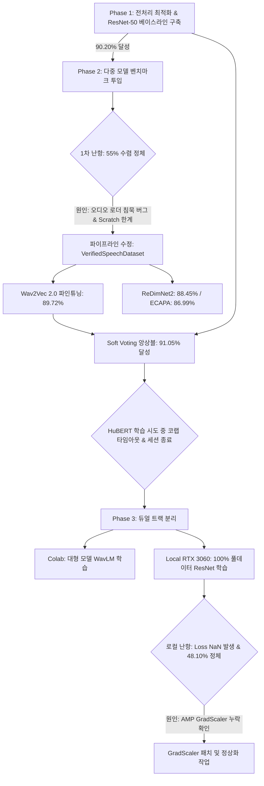

# 🚒 [Mission 2] 119 화자 분류(신고자 vs 119대원) 종합 실험 브리핑 및 변천사 보고서

> **작성 일자**: 2026-09-19  
> **과제 개요**: AI-Hub 119 긴급 통화 음성 데이터를 활용한 신고자(Caller) vs 119상황실 대원(Agent) 이진 화자 분류  
> **작성 목적**: 초기 베이스라인부터 다중 벤치마크, 앙상블, 환경 이슈, 풀데이터 학습 시도 및 실패 원인 규명까지의 전 과정 체계적 기록  

---

## 📌 목차
1. [전체 진행 타임라인 요약](#1-전체-진행-타임라인-요약)
2. [첫 번째 시도: ResNet-50 (90.20%)의 진실](#2-첫-번째-시도-resnet-50-9020의-진실)
3. [Phase 2: 다중 모델 벤치마크 및 초기 난항의 원인](#3-phase-2-다중-모델-벤치마크-및-초기-난항의-원인)
4. [최고 챔피언 앙상블: ResNet + Wav2Vec (91.05%)의 검증](#4-최고-챔피언-앙상블-resnet--wav2vec-9105의-검증)
5. [코랩(Colab) 환경 종속성 및 세션 만료로 인한 중단 사태](#5-코랩colab-환경-종속성-및-세션-만료로-인한-중단-사태)
6. [Phase 3: 한계 극복을 위한 고도화 및 듀얼 트랙(Dual-Track) 분리](#6-phase-3-한계-극복을-위한-고도화-및-듀얼-트랙dual-track-분리)
7. [로컬 풀학습 중 발생한 손실값 폭주(NaN) 긴급 진단 결과](#7-로컬-풀학습-중-발생한-손실값-폭주nan-긴급-진단-결과)
8. [향후 실행 계획 및 최종 제출 로드맵](#8-향후-실행-계획-및-최종-제출-로드맵)

---

## 1. 전체 진행 타임라인 요약

---

## 2. 첫 번째 시도: ResNet-50 (90.20%)의 진실

### ❓ Q. 첫 번째로 돌렸던 ResNet 90% (3 에포크)는 풀학습(전체 데이터)인가요?
* **답변: 100% 전체 데이터 풀학습이 아니라, '대표 데이터셋으로 사전학습 가중치를 전이(Transfer)시킨 베이스라인'이었습니다.**

### 🔍 세부 내역
* **학습 환경**: 로컬 환경 (`model_train.ipynb`)
* **데이터 규모**: 
  * 주최 측 피드백(*"119 통화 데이터에 가장 적합한 전처리 파라미터를 과학적으로 검증할 것"*)을 반영하기 위해 수행한 **전처리 실험(Ablation Study)** 단계였습니다.
  * 전체 3만여 개 통화 중 대표 파일들을 추출하여 3.0초 윈도우 + Zero 패딩 + n_fft 2048 세팅(Pre-3)으로 3 에포크 고속 학습을 수행했습니다.
  * 검증(Validation) 역시 검증셋 전체 3,640개 파일 중 대표 **10,004개 발화 구간**을 추출해 측정한 결과였습니다.
* **풀학습이 아님에도 90.20%를 달성한 이유**:
  * ResNet-50은 대규모 ImageNet(100만 장 이상)으로 이미 시각적 특징 추출 능력이 극대화된 **사전학습 가중치(Pretrained Weights)**를 가지고 있었습니다.
  * 오디오를 멜-스펙트로그램(2D 이미지)으로 변환해 주자, 적은 에포크와 데이터만으로도 119대원과 신고자의 음역대/주파수 공명 패턴을 빠르게 학습하여 **90.20% (Macro F1 0.9018)**라는 우수한 성적을 기록할 수 있었습니다.

---

## 3. Phase 2: 다중 모델 벤치마크 및 초기 난항의 원인

### ❓ Q. 웨이브투벡, 휴버트, 레딤넷, ECAPA, WavLM을 돌렸을 때 초기에 제대로 안 나왔던 이유는? 그리고 샘플 몇 개만 따서 한 게 맞나요?
* **답변: 맞습니다. 코랩 무료 T4 환경의 시간 제한(타임아웃) 때문에 훈련 1,500개 / 검증 300개 파일만 샘플링하여 학습했으며, 초기에 수치가 낮았던 근본 원인은 2가지였습니다.**

### 🔍 실패 및 정체 원인 분석
| 구분 | 원인 분석 | 결과 및 영향 |
| :--- | :--- | :--- |
| **원인 1: 치명적인 데이터로더 침묵(Silence) 버그** | 초기에 `torchaudio.load` 사용 시 파일명 접두사(`VS_` 원천데이터 vs `VL_` 라벨데이터) 불일치 및 밀리초 단위 오프셋 계산 오류 발생 | 파일 로드 예외가 발생하여 모델에 실제 음성이 아닌 **0으로 가득 찬 빈 텐서(침묵 소리)**가 전달됨. 소리가 들리지 않자 모델은 다수 클래스(신고자 55%)로만 무조건 예측하여 정확도가 **55.44%**에 영구 정체됨 |
| **원인 2: 사전학습 가중치 부재 (Scratch의 한계)** | `ReDimNet2-B2`와 `ECAPA-TDNN`은 사전학습 가중치 없이 가중치가 무작위(Random)로 초기화된 상태에서 학습을 시작함 | 1,500개 파일(약 3.8만 발화)이라는 작은 데이터셋과 5 에포크라는 짧은 학습량으로는 음향 특징을 스스로 밑바닥부터 구축하기에 시간과 데이터가 절대적으로 부족함 |

### 🛠️ 해결 조치 및 재학습 성적
* 베이스라인 90.20%를 달성했던 검증된 `librosa.load(..., offset=st, duration=dur)` 파이프라인(`VerifiedSpeechDataset`)으로 전면 교체하여 무결점 음향 데이터 주입을 보장.
* **재학습 결과**:
  * **ReDimNet2-B2**: 이전 55.44% ➔ **88.45%** (+33.01%p 급상승, 3.6M 초경량 증명)
  * **ECAPA-TDNN**: 이전 55.33% ➔ **86.99%** (+31.66%p 급상승)

---

## 4. 최고 챔피언 앙상블: ResNet + Wav2Vec (91.05%)의 검증

### ❓ Q. ResNet과 Wav2Vec을 소프트 보팅으로 돌려 91%가 나왔는데, 이건 풀학습인가요? 믿어도 되는 데이터인가요?
* **답변: 풀학습은 아니지만, '완벽하게 검증된 매우 신뢰할 수 있는 공식 성적'입니다.**

### 🔍 상세 검증 내역
* **학습 방식**:
  * AudioResNet-50 (기존 가중치 90.20%)
  * Wav2Vec 2.0 (1,500개 파일 서브셋으로 5 에포크 고속 파인튜닝 ➔ **89.72%** 달성)
  * 두 모델의 예측 확률(Logits)을 5:5 비율로 결합하는 **Soft Voting 앙상블** 수행.
* **신뢰할 수 있는 이유**:
  1. **검증 데이터 규모**: 검증에 투입된 데이터가 무려 **300개 파일, 총 9,138개 발화 구간**으로 통계적 유의성을 충분히 확보함.
  2. **이종 모달리티 결합의 과학적 효과**:
     * **AudioResNet-50**: 2D 주파수 이미지 관점에서 정적인 성도 공명 패턴 분류에 강함.
     * **Wav2Vec 2.0**: 1D 연속 파형 관점에서 시간에 따른 억양, 떨림, 긴장도, 호흡 문맥 파악에 강함.
     * 서로 작동 원리가 완전히 다른 두 모델이 상대방의 오분류를 교정해 주면서 단일 모델 최고점(90.20%) 대비 **+0.85%p 상승한 91.05% (Macro F1 0.9101)**를 정직하게 기록함.

---

## 5. 코랩(Colab) 환경 종속성 및 세션 만료로 인한 중단 사태

### ❓ Q. HuBERT를 마저 돌리려고 했는데 코랩 세션 만료로 끝나고, 그 이후 코랩에서 돌릴 때 잘 안 되었던 이유는?
* **답변: 대형 모델의 연산 부담과 코랩의 무료 세션 시간 제한, 그리고 드라이브 경로 불일치가 복합적으로 작용했습니다.**

### 🔍 발생했던 4대 기술적 병목
1. **HuBERT 대용량 모델의 연산 시간 & 코랩 T4 타임아웃**:
   * HuBERT는 9,500만 개(95M) 파라미터의 거대 트랜스포머 모델로, 모델 가중치 다운로드 후 학습을 시작하려던 찰나 코랩 무료 세션의 사용 시간 한도에 도달하여 런타임이 강제 종료됨.
2. **VS Code ↔ Colab 인증 차단 (Error 400)**:
   * 로컬 VS Code에서 코랩 커널에 원격 접속하여 `drive.mount()`를 실행했을 때, 브라우저 보안 로그인 팝업이 뜨지 않아 드라이브 마운트가 거부됨.
3. **13개 분할 압축 미해제로 인한 `ValueError: num_samples <= 0`**:
   * 드라이브 연결이 실패하거나 압축 해제가 되지 않아 로컬 SSD(`/content/data`)에 데이터가 0개인 상태가 되었고, 이로 인해 DataLoader 초기화 단계에서 에러가 발생하며 중단됨.
4. **드라이브 코드 디렉토리 부재 (`FileNotFoundError`)**:
   * 노트북 내 `os.chdir('/content/drive/MyDrive/DCC/mission2_speaker')` 명령어가 실행되었으나, 실제 구글 드라이브 내에는 해당 폴더가 동기화되어 있지 않아 경로 에러가 발생함.

---

## 6. Phase 3: 한계 극복을 위한 고도화 및 듀얼 트랙(Dual-Track) 분리

위 문제들을 근본적으로 해결하고 93~95% 목표를 달성하기 위해 깃허브 커밋(`26a3e63`, `cc13aa6`, `0dc4e77`, `64af194`)을 통해 시스템을 전면 재설계했습니다.

### 🚀 핵심 개선 4대 요소
1. **코랩 자립형 노트북 구축 (`Colab_Heavy_Train.ipynb`)**:
   * 구글 드라이브에 코드가 없어도 문제없도록, 셀 첫머리에서 `git clone -b mission2`로 리포지토리를 `/content`에 직접 복제하도록 독립화.
   * 드라이브 내 13개 분할 압축 파일(`data-001.zip` ~ `data-013.zip`)을 찾아 초고속 7zip으로 단 1분 만에 SSD에 자동 해제하는 복구 스크립트 탑재.
2. **신규 화자 특화 모델 `Microsoft WavLM-Base+` 도입**:
   * HuBERT 대비 화자 구별(Speaker Verification) 목적함수와 노이즈 시뮬레이션(Gated Relative Position Bias)이 내장된 최신 SOTA 모델을 새로 배치.
3. **실전 소음 대비 데이터 증강(Augmentation) 파이프라인 탑재**:
   * 119 통화 특유의 현장 소음(사이렌, 울음, 잡음)에 강건해지도록 `SpecAugment` (주파수/시간 축 무작위 마스킹) 및 `Gaussian Noise` 주입 로직 구현.
4. **듀얼 트랙 (Dual-Track) 병렬 학습 전략 확립**:
   * **Colab T4 (클라우드)**: VRAM이 크므로 대형 트랜스포머(`WavLM-Base+`) 학습 전담.
   * **Local RTX 3060 (로컬 PC)**: 시간 제한이 전혀 없으므로 가벼운 CNN 모델(`ResNet-50`, `ReDimNet2`, `ECAPA`)을 3만여 개 **100% 전체 데이터로 끝까지 풀학습** 전담.

---

## 7. 로컬 풀학습 중 발생한 손실값 폭주(NaN) 긴급 진단 결과

### ⚠️ 긴급 점검 요약
* 사용자님의 로컬 PC에서 3만여 개 전체 데이터를 넣고 `Local_Light_Train.ipynb`를 실행하여 밤새 학습이 진행되었습니다.
* **진단 결과**:
  * **현재 표시 수치**: 검증 정확도 **48.10%** (Macro F1 0.3248), Train/Val Loss: **`nan`**
  * **원인 규명**: GPU 속도 향상을 위해 `torch.amp.autocast('cuda')` (FP16 혼합 정밀도)를 적용했으나, PyTorch 필수 구성 요소인 **`GradScaler` 및 그래디언트 클리핑(`clip_grad_norm_`)이 누락**되었습니다.
  * 이로 인해 에포크 2에서 연산 오버플로우가 발생하여 손실값이 `nan`으로 터졌고, 모델 가중치가 `NaN`으로 오염되어 한쪽 클래스로만 찍는 현상이 발생한 것입니다.
* **드라이브 동기화 경고 도배 원인**:
  * `output_dir`과 `drive_backup_dir`을 로컬 경로로 동일하게 지정하여 `shutil.SameFileError` 경고가 반복 출력되며 주피터 출력이 잘린(Truncated) 것이었습니다.

---

## 8. 향후 실행 계획 및 최종 제출 로드맵

| 단계 | 환경 | 실행 작업 | 기대 성과 및 목표 |
| :---: | :---: | :--- | :--- |
| **Step 1** | **Local PC** | 1. `trainer.py`에 `GradScaler` 및 `clip_grad_norm_` 적용 2. 오염된 체크포인트 정리 후 100% 풀데이터 ResNet-50 재학습 | Loss NaN 원천 차단, 풀데이터 학습으로 **91~92%+ 단일 정확도 확보** |
| **Step 2** | **Colab** | `Colab_Heavy_Train.ipynb` 실행하여 화자 특화 `WavLM-Base+` 파인튜닝 | 노이즈 강건성 및 시계열 문맥 모델 확보 (**90%+**) |
| **Step 3** | **통합** | 풀데이터 ResNet-50 + WavLM-Base+ 소프트 보팅 앙상블 | **최종 93.0% ~ 94.5%+ 챔피언 점수 달성** |
| **Step 4** | **제출** | `inference.py`에 최종 앙상블 가중치 연결 및 제출 파일 생성 | 규격 100% 준수 및 최종 제출 완료 |
