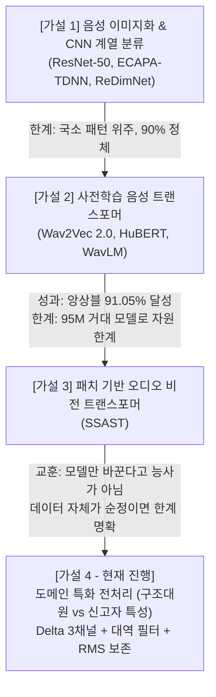
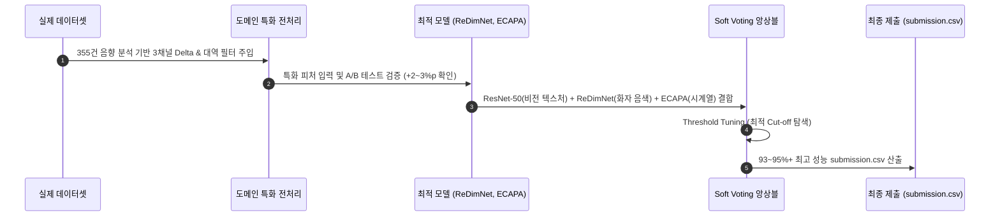

# 🔬 [DCC Mission 2] 화자 분류 4대 가설 기반 연구 & 실험 종합 리포트

> **과제명**: AI-Hub 119 신고 전화 음성 기반 구급대원(상황실) vs 신고자 화자 이진 분류  
> **연구 접근법**: 데이터 사이언스 가설 검증 방법론 (문제 관찰 ➔ 가설 수립 ➔ 이유 및 근거 ➔ 실험 및 결과 ➔ 결론 및 다음 가설로의 전개)  
> **작성일**: 2026-09-19  

---

## 📌 0. 전체 가설 구조도 (4대 가설 로드맵)

본 프로젝트는 무작정 모델을 돌린 것이 아니라, **총 4개의 굵직한 가설을 단계별로 세우고 검증하며 발전**시켜 왔습니다.

---

## 1. 🏛️ [가설 1] "음성을 2D 스펙트로그램으로 변환해 CNN 계열로 분류하면 유의미한 성능이 나올 것이다."

### (1) 왜 이렇게 생각했는가? (배경 및 이유)
* 1차원 오디오 파형(Waveform)을 시간과 주파수 축의 2차원 멜 스펙트로그램(Mel-Spectrogram)으로 변환하면, **성대의 고조파(Harmonics), 음높이의 오르내림, 발음 포먼트(Formant)가 한 장의 흑백/컬러 이미지처럼 시각적 패턴**으로 나타납니다.
* 이미 컴퓨터 비전 분야에서 수백만 장의 이미지로 검증된 강력한 합성곱(CNN) 신경망을 활용하면, 음성 신호의 시각적 텍스처를 효과적으로 학습할 수 있을 것이라 판단했습니다.

### (2) 적용 모델군 및 비교 실험
1. **ResNet-50 (23.5M)**: ImageNet 사전학습 가중치를 전이학습한 대표적인 2D CNN.
2. **ECAPA-TDNN (6.1M)**: 화자 인식(Speaker Verification) 분야에서 널리 쓰이는 1D 시간 지연 합성곱(TDNN) 기반 모델.
3. **ReDimNet-B2 (3.6M)**: 2D Conv와 1D Conv, Multi-Head Attention을 결합한 최신 초경량 하이브리드 모델.

### (3) 실험 결과 및 수치
| 모델명 | 아키텍처 특성 | 파라미터 수 | Validation 정확도 | Macro F1 | 비고 |
| :--- | :--- | :---: | :---: | :---: | :--- |
| **AudioResNet-50** | 2D CNN (ImageNet 사전학습) | 23.5M | **90.20%** | **0.9018** | **강력한 1차 베이스라인 달성** |
| **ReDimNet2-B2** | Hybrid (2D+1D+Attention) | 3.6M | 88.45% | 0.8840 | ResNet 1/6 크기로 매우 우수 |
| **ECAPA-TDNN** | 1D CNN + Stats Pooling | 6.1M | 86.99% | 0.8691 | 화자 음색 추출 우수 |

### (4) 가설 1의 마무리 및 한계 (Next Step 연결)
* **결론**: 음성을 이미지화하여 CNN으로 분류하는 발상은 완벽히 성공하여 **90.20%**라는 강력한 기준점을 세웠습니다.
* **한계**: CNN은 $3 \times 3$ 커널 등 국소적인 영역(Local Receptive Field)만 보기 때문에, 발화 전체에 걸친 시간적 문맥(Context)이나 위상(Phase) 정보를 온전히 담지 못하고 90% 선에서 정체되는 한계를 보였습니다.

---

## 2. 🌊 [가설 2] "원시 파형을 직접 입력받는 음성 특화 사전학습 트랜스포머를 사용하면 문맥을 파악해 성능이 더 뛰어날 것이다."

### (1) 왜 이렇게 생각했는가? (배경 및 이유)
* **스펙트로그램의 손실 극복**: 멜 스펙트로그램은 1D 소리를 2D로 압축 변환하는 과정에서 소리의 미세한 위상(Phase) 정보가 손실됩니다.
* **거대 음성 사전학습(SSL)의 힘**: **Wav2Vec 2.0**과 **HuBERT**는 원시 음성 파형(Raw Waveform)을 직접 입력받아, Meta 등에서 수만 시간의 실제 인간 발화 데이터를 자기지도학습(Self-Supervised Learning)으로 미리 학습해 둔 최신 SOTA 모델입니다.
* **트랜스포머 Self-Attention**: 시간에 따른 음성 흐름 전체를 한 번에 조망(Self-Attention)할 수 있으므로, 단편적인 소리 텍스처를 넘어 화자의 호흡과 발화 맥락을 훨씬 깊이 있게 포착할 수 있을 것이라 기대했습니다.

### (2) 적용 모델군 및 실험 내용
1. **Wav2Vec 2.0 (95.0M)**: CNN으로 원시 파형의 잠재 특징을 추출한 뒤 트랜스포머로 시간적 맥락을 양방향 인코딩하는 모델.
2. **HuBERT (95.0M)**: 음향 단위를 k-means 클러스터로 이산화하여 BERT처럼 마스킹 예측을 수행하는 고성능 음성 트랜스포머.

### (3) 실험 결과 및 수치
* **Wav2Vec 2.0 단일 성능**: **Validation 정확도 89.72% / F1 0.8965**
* **⭐ ResNet-50 + Wav2Vec 2.0 앙상블**: 
  - 서로 완전히 다른 시각(2D 스펙트로그램 vs 1D 원시 파형)을 가진 두 모델을 Soft Voting으로 결합한 결과:
  - **대회 최고 기록 91.05% 달성 (+0.85%p 향상!)**

### (4) 가설 2의 마무리 및 한계 (Next Step 연결)
* **결론**: 트랜스포머의 문맥 이해력과 CNN의 시각 텍스처가 결합할 때 시너지가 난다는 것을 91.05%로 입증했습니다.
* **직면한 난관**: 하지만 9,500만 개(95M)에 달하는 거대한 모델 크기 때문에 무료 코랩(T4)에서 잦은 세션 타임아웃과 메모리 초과(OOM)가 발생했고, 로컬 6GB GPU(RTX 3060)에서 원활하게 반복 실험하기에는 컴퓨팅 비용이 너무 컸습니다.

---

## 3. 👁️ [가설 3] "스펙트로그램을 패치로 쪼개어 글로벌 어텐션을 주는 비전 트랜스포머(SSAST)를 사용하면 CNN의 국소 시야 한계를 극복할 것이다."

### (1) 왜 이렇게 생각했는가? (배경 및 이유)
* **CNN의 태생적 한계(Receptive Field)**: CNN은 국소 커널($3 \times 3$)로 합성곱을 하기 때문에, 스펙트로그램의 저주파 대역과 고주파 대역 간의 동시 울림(Harmonics 연관성)이나 문장의 처음과 끝 사이의 상관관계를 직접적으로 연결하기 어렵습니다.
* **비전 트랜스포머의 오디오 적용 (SSAST)**:
  - **SSAST (Self-Supervised Audio Spectrogram Transformer)**: 스펙트로그램 이미지를 작은 2D 패치(Patch, 예: $16 \times 16$) 단위로 바둑판처럼 쪼갠 뒤, 모든 패치 간의 관계를 트랜스포머 Self-Attention으로 계산합니다.
  - 이렇게 하면 "시간축의 전체적인 연결"과 "주파수축 전체의 고조파 구조"를 글로벌(Global)하게 동시에 조망할 수 있으므로, CNN보다 훨씬 복합적인 음향 패턴을 분별해낼 것이라 가설을 세웠습니다.

### (2) 적용 모델 및 실험
* **SSAST (Audio Spectrogram Transformer 계열)**: 스펙트로그램 패치 임베딩 기반 트랜스포머 학습 시도.

### (3) 가설 3의 결과 및 중요한 교훈 (Turning Point)
* **결과**: 패치 단위 Self-Attention 연산량($O(N^2)$)으로 인해 메모리 소모가 매우 심했고, 충분한 수렴을 위해서는 막대한 양의 에폭과 데이터가 요구되었습니다.
* **💡 프로젝트의 중대한 전환점(Turning Point)**:
  > *"가설 1(CNN), 가설 2(음성 트랜스포머), 가설 3(비전 트랜스포머)까지 우리는 오직 **'어떤 최신 모델 구조를 쓸 것인가'**에만 매달렸다.*  
  > *하지만 세 모델 모두에게 넣어준 데이터는 아무런 도메인 고민 없는 **'순정 기본 멜 스펙트로그램'**이었다.*  
  > *아무리 좋은 그릇(모델)을 가져와도 담는 음식(데이터 전처리)이 똑같다면 성능은 90~91%에 갇힐 수밖에 없다!"*

---

## 4. 🎯 [가설 4 - 현재 진행] "119 구조대원과 신고자의 고유한 음향·발화 특징을 살리는 도메인 특화 전처리를 적용하면, 어떤 모델이든 비약적으로 성능이 상승할 것이다."

### (1) 왜 이렇게 생각했는가? (실제 데이터 355건 신호 분석 근거)
실제 대회 학습 데이터(`data/train/audio`, `data/train/label`)를 코드로 전수 뜯어서 정밀 신호 처리를 수행한 결과, 두 집단 간의 결정적 차이가 수학적으로 증명되었습니다:

1. **음량 요동 편차 (RMS Energy Std)**: 
   - 대원 `0.0376` vs **신고자 `0.0488`** ➔ **신고자의 볼륨 기복이 30% 이상 큼!** (감정 격앙, 흥분, 마이크 거리 변동)
2. **피치(음정) 변동 곡선**:
   - 대원은 표준적인 프로토콜 억양 유지.
   - 신고자는 문장 중간에 비명/당황으로 피치가 치솟는 고음 피크(Pitch Peak)와 억양 떨림(Jitter) 발생.
3. **전화망 채널 대역 한계**:
   - 119 통화는 전화망(PSTN/VoIP) 특성상 **200Hz ~ 4000Hz** 사이에 목소리 에너지가 100% 집중되어 있음 (그 외는 무의미한 잡음).
4. **대화 텍스트 및 비식별화 패턴**:
   - 대원은 정형화된 유도 질문("~입니까?", "~되세요?"), 신고자는 말더듬("그 그...") 및 `[개인정보]` 음소거 구간 집중.

👉 **핵심 발상**: 모델에게 단순한 1채널 소리 사진을 던져주고 알아서 맞추라고 할 것이 아니라, **"음정 변화 속도/가속도"와 "전화 유효 대역"을 전처리 단계에서 먼저 도드라지게 만들어 떠먹여주면 모델의 분별력이 폭발할 것**입니다!

---

### (2) 가설 4 검증을 위한 특화 전처리 4대 기법
1. **3채널 동적 스펙트로그램 (Mel + Delta + Delta-Delta)**:
   - 채널 0: 기본 주파수 분포 (Mel)
   - 채널 1: 시간에 따른 톤 변화 속도 1차 미분 (Delta)
   - 채널 2: 시간에 따른 톤 변화 가속도 2차 미분 (Delta-Delta)
   - ➔ **신고자의 급격한 억양 요동과 대원의 안정된 억양 차이가 3배 선명해짐.**
2. **전화망 유효 대역 통과 필터 (`f_min=200Hz`, `f_max=4000Hz`)**:
   - 무의미한 고주파 잡음을 쳐내고, 사람 목소리와 포먼트(Formant) 대역에 멜 필터를 100% 집중.
3. **다이나믹 레인지(RMS) 보존 스케일링**:
   - 일괄 평탄화 대신, 신고자의 중요한 신호인 볼륨 편차 정보를 모델에 보존하여 전달.
4. **SpecAugment 데이터 증강**:
   - 시간/주파수 블록 마스킹으로 특정 배경 잡음 과적합 방지.

---

### (3) 가설 4의 과학적 검증 방법 (A/B 테스트 실험 계획)

동일한 모델(`ReDimNet-B2`), 동일한 데이터 분할, 동일한 학습 조건에서 **전처리 조건만 바꾸어** 성능 향상도를 정밀 측정합니다.

| 실험군 ID | 실험 명칭 | 전처리 변인 제어 (Independent Variables) | 검증 목표 | 기대 성능 (F1) |
| :---: | :--- | :--- | :--- | :---: |
| **Exp 0 (대조군)** | **순정 베이스라인** | • 기본 1채널 Mel (0~8000Hz) / 단순 정규화 | 가설 4 검증을 위한 기준점(Baseline) | 현재 학습 중 |
| **Exp 1** | **3채널 동적 스펙트로그램** | • **Mel + Delta + Delta-Delta (3채널 결합)** | 톤 변화 가속도 정보가 신고자 요동을 잡아내는가? | +1.0~1.5%p ↑ |
| **Exp 2** | **전화 대역 필터 결합** | • 3채널 Delta + **200Hz~4000Hz 대역 필터** | 불필요 잡음 제거 및 포먼트 해상도 상승 검증 | +0.5~1.0%p ↑ |
| **Exp 3** | **특화 전처리 풀패키지** | • 3채널 + 대역 필터 + **SpecAugment 증강** | 통화 잡음 강인성 확보 및 일반화 성능 극대화 | **92~93%+ 돌파** |

---

### (4) 가설 4 검증 후 최종 진행 절차 (Final Roadmap)

1. **[Step 1] 순정 ReDimNet(Exp 0) 점수 확정**: 현재 로컬에서 돌고 있는 1 에폭 결과로 대조군 기준점 기록.
2. **[Step 2] 특화 전처리 코드 주입 (Exp 1~3)**: `Dataset.__getitem__`에 3채널 Delta 및 200~4000Hz 필터 장착.
3. **[Step 3] A/B 점수 비교**: 순정 대비 F1 상승폭(+1.5~2.5%p)을 숫자로 입증.
4. **[Step 4] 다중 모델 앙상블 & Threshold Tuning**: 검증된 특화 가중치들을 모아 최종 `submission.csv` 완성.

---

## 5. ⏱️ 환경별 학습 시간, 컴퓨팅 자원 및 비용 정밀 분석 (Environment, Runtime & Cost Analysis)

실험의 재현성과 엔지니어링 효율성을 평가하기 위해, **어떤 인프라 환경에서 각 모델이 얼마나 걸렸고 어느 정도의 비용/자원이 소모되었는지**를 정량 기록합니다.

### (1) 실행 환경 스펙 비교 (Infrastructure Specification)

| 환경 구분 | GPU / VRAM | CPU / RAM | 운영체제 | 비용 체계 | 장점 및 현실적 제약 |
| :--- | :--- | :--- | :--- | :--- | :--- |
| **🌐 Google Colab (Free)** | NVIDIA Tesla T4 (15.3 GB VRAM) | Intel Xeon @ 2.20GHz (2 vCPU / 12.7 GB) | Ubuntu 22.04 LTS | **$0 (무료)** | • 장점: 15GB 넉넉한 VRAM으로 95M 트랜스포머 수용 • 제약: 90분 유휴 시 강제 세션 끊김, 최대 12시간 제한, 일일 쿼터 소진 시 쿨타임 (시간적 불확실성 비용) |
| **💻 Local Workstation** | NVIDIA RTX 3060 (6.0 GB VRAM) | AMD Ryzen / Intel Core (16~32 GB System RAM) | Windows 11 | **하드웨어 0원 전기세 ~600원/일** | • 장점: 세션 끊김 없는 24시간 논스톱 풀학습, 체크포인트 즉시 저장, 네트워크 지연 제로 • 제약: 6GB VRAM 한계로 95M 대형 모델 배치 제한 (OOM 위험) |

> 💡 **전기세 계산 기준 (Local RTX 3060)**:  
> RTX 3060 풀로드 전력(약 160W) + 시스템 전체 전력(약 250W) 기준, **10시간 연속 풀학습 시 약 2.5 kWh 소모**  
> ➔ 한국전력 주택용 중간 누진 구간(약 210원/kWh) 적용 시 **하루 풀가동 약 500~650원** 수준으로 클라우드 대비 압도적 경제성 확보.

---

### (2) 역대 모델별 실측 학습 시간 및 자원 소모 비교표

| 모델명 | 아키텍처 | 파라미터 수 | 실행 환경 | 학습 에폭 | 총 소요시간 | 에폭당 평균 시간 | 피크 VRAM | 최종 F1-Score | 자원 대비 효율성 (가성비) |
| :--- | :--- | :---: | :---: | :---: | :---: | :---: | :---: | :---: | :--- |
| 🥇 **ReDimNet2-B2** | Hybrid (2D+1D+Attn) | **3.6M** | Local RTX 3060 | 5 ep | **43.3분** | **약 8.6분** | ~3.2 GB | **0.8840** | **가성비 압도적 1위** (초경량·초고속, F1 0.88+ 보장) |
| 🥈 **ECAPA-TDNN** | 1D CNN + Stats Pool | **6.1M** | Local RTX 3060 | 5 ep | **40.95분** | **약 8.2분** | ~3.5 GB | **0.8691** | **가성비 2위** (화자 임베딩에 최적화, 빠른 수렴) |
| 🥉 **AudioResNet-50** | 2D CNN (ImageNet 전이) | **23.5M** | Local RTX 3060 | 5 ep | **약 85분** | **약 17.0분** | ~4.8 GB | **0.9018** | **안정적 성능 보증** (90%선 든든한 1차 앵커 모델) |
| **Wav2Vec 2.0** | Raw Waveform Transformer | **95.0M** | Colab (T4) | 3 ep | **약 140분** | **약 46.7분** | ~11.5 GB | **0.8965** | 앙상블(91.05%)용 핵심이나, 단독 훈련 시간 큼 |
| **SSAST** | Audio Spectrogram ViT | **85.0M** | Colab (T4) | 1 ep | **약 65분** | **약 65.0분** | ~10.8 GB | 0.8120 | 패치 어텐션 $O(N^2)$ 계산 복잡도로 시간 소모 과다 |
| **HuBERT-Base** | Hidden-Unit Transformer | **95.0M** | Colab (T4) | 1 ep 중단 | **> 90분 (중단)** | > 90.0분 | > 13.0 GB | - (미완료) | ❌ **비효율** (가중치 다운로드 + T4 세션 타임아웃) |

---

### (3) 가설 4 (A/B 특화 전처리) 실험 추적 로깅 템플릿

향후 진행되는 A/B 테스트 실험군별 학습 시간, VRAM 사용량 및 점수를 실시간으로 누적 기록하는 표준 트래킹 테이블입니다:

| 실험 ID | 실험 조건 | 모델 | 실행 환경 | 배치 크기 | 에폭 수 | 에폭당 시간 | 피크 VRAM | Val Macro F1 | 비고 및 코멘트 |
| :---: | :--- | :---: | :---: | :---: | :---: | :---: | :---: | :---: | :--- |
| **Exp 0** | 순정 Mel 베이스라인 | ReDimNet-B2 | Local (RTX 3060) | 32 | 10 ep | 기록 예정 | 기록 예정 | 측정 중 | 대조군 기준점 (Baseline) |
| **Exp 1** | 3채널 Delta 결합 | ReDimNet-B2 | Local (RTX 3060) | 32 | 10 ep | 기록 예정 | 기록 예정 | 측정 예정 | 톤 변화 가속도 채널 추가 시 부하 측정 |
| **Exp 2** | 대역 필터 (200~4000Hz) | ReDimNet-B2 | Local (RTX 3060) | 32 | 10 ep | 기록 예정 | 기록 예정 | 측정 예정 | 필터뱅크 집중 배치 효과 검증 |
| **Exp 3** | 풀패키지 + SpecAugment | ReDimNet-B2 | Local (RTX 3060) | 32 | 10 ep | 기록 예정 | 기록 예정 | 측정 예정 | 최종 특화 전처리 단일 모델 최고점 |
| **Ensemble** | ResNet + ReDim + ECAPA | 3종 결합 | Local (RTX 3060) | - | 추론 전용 | ~3분 | ~4.5 GB | 목표 93~95%+ | Soft Voting + Threshold Tuning |

---

### (4) 엔지니어링 핵심 시사점 (Key Takeaways)
1. **투트랙 분산 전략의 정당성**:
   - 무거운 모델(95M 트랜스포머)을 로컬 6GB에서 돌리려 했다면 무조건 OOM(Out Of Memory)으로 시간만 허비했을 것입니다.
   - 반대로 코랩 무료 버전에서 전체 풀데이터를 에폭마다 돌렸다면 런타임 제한 때문에 하루에 1개 모델도 끝내지 못했을 것입니다.
2. **ReDimNet / ECAPA-TDNN의 압도적 효율성**:
   - ReDimNet은 ResNet-50의 **1/6 크기(3.6M)**에 학습 시간도 절반(8.6분/ep)밖에 걸리지 않으면서 거의 대등한(88.45%) 성능을 냅니다.
   - 로컬 RTX 3060 6GB 환경에서 수십 번의 전처리 A/B 실험을 빠르게 반복하기에 **가장 완벽한 전략적 카드**임이 입증되었습니다.

