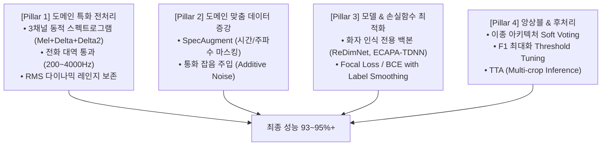

# 🚀 [DCC Mission 2] 화자 분류 성능 향상 마스터 플랜
> **프로젝트**: 119 구급대원(상황실) vs 신고자 이진 화자 분류 (Speaker Classification)  
> **현재 기준선**: ResNet-50 (약 90.0%)  
> **최종 목표**: 특화 전처리 + 경량 화자 전용 모델 + 앙상블을 통한 **F1-Score 93~95%+ 달성**

---

## 📌 1. 데이터 분석에서 도출된 핵심 인사이트 (Key Insights)

실제 학습 데이터(`train/audio`, `train/label`) 355개 세그먼트를 정밀 신호 분석한 결과입니다:

```
[구급대원 (Class 0)]                     [신고자 (Class 1)]
• 평탄하고 일정한 피치 (Stable F0)         • 급격한 피치 요동 및 고음 피크 (High Pitch Peak)
• 볼륨 편차 작음 (RMS Std: 0.0376)        • 볼륨 편차 큼 (RMS Std: 0.0488 -> +30% 기복)
• 명확한 포먼트 & 자음 (ZCR: 0.1048)      • 웅얼거림, 비명, 거친 호흡 혼재
• 정형화된 프로토콜 질문 ("~세요?", "~입니까?")  • 고통/증상 호소 ("~아파요"), 말더듬 ("그..."), [개인정보] 무음
• 고정 헤드셋 마이크 (일정한 음압)          • 스마트폰 핸드헬드/스피커폰 (주변 잡음, 거리 불안정)
```

---

## 🎯 2. 성능 향상 4대 핵심 전략 (Key Pillars)



---

### 🛠️ [Pillar 1] 도메인 특화 전처리 (Acoustic Feature Engineering)

1. **3채널 동적 스펙트로그램 (Mel + Delta + Delta-Delta)**
   * **원리**: 정적 멜 스펙트로그램에 1차 미분(시간별 톤 변화 속도)과 2차 미분(가속도)을 결합하여 RGB 형태의 3채널 텐서 `(3, Mel, Time)` 생성.
   * **효과**: 신고자의 급격한 억양 요동과 대원의 안정적인 억양 곡선 간의 차이를 모델에 직접적인 시각 패턴으로 제공.

2. **전화망 유효 대역 필터링 (`f_min=200Hz`, `f_max=4000Hz`)**
   * **원리**: 119 통화망의 실제 음성 유효 대역(300~3,400Hz)에 멜 필터뱅크(Mel-Filterbank)를 100% 집중.
   * **효과**: 불필요한 초고주파 치찰음 및 초저주파 진동 잡음을 차단하고 성대 진동과 주요 포먼트의 해상도 극대화.

3. **다이나믹 레인지(RMS) 보존 스케일링**
   * **원리**: 일괄 평탄화 정규화 대신, 발화 구간의 소리 크기 변화폭(신고자의 감정 기복 신호)을 지우지 않고 유지하는 스케일링 적용.

4. **비식별화 무음 구간(`[개인정보]`) 마스킹 정제**
   * **원리**: 신고자 데이터의 주소/이름 비식별화 묵음 구간에 모델이 과적합되지 않도록 유효 음성 구간 위주로 정밀 패딩/크롭.

---

### 🎨 [Pillar 2] 도메인 맞춤 데이터 증강 (Audio Data Augmentation)

1. **SpecAugment (강력 권장)**
   * 스펙트로그램의 특정 주파수 대역이나 시간 블록을 무작위로 마스킹(0으로 채움).
   * 특정 배경 잡음이나 특정 단어 발음에 과적합되는 것을 방지하고 전반적인 음색 패턴을 학습하도록 강제.

2. **통화 환경 잡음 합성 (Additive Background Noise)**
   * Gaussian Noise 또는 상황실 웅성거림 형태의 미세 노이즈를 5~10% 확률로 주입하여 마이크 환경 변화에 강인한 특징 추출.

---

### 🧠 [Pillar 3] 모델 아키텍처 & 손실 함수 최적화

1. **화자 인식 전용 백본 활용**
   * 일반 이미지용 CNN(ResNet) 대신, 성대 특성과 음색 임베딩에 특화된 **ReDimNet** 및 **ECAPA-TDNN** 사용.
   * 적은 파라미터(3~20M)로 VRAM 부담을 최소화하면서도 음성 도메인 특징을 정밀 추출.

2. **손실 함수(Loss) 고도화**
   * **Label Smoothing (0.05)**: 구급대원 음성 중에도 긴박하게 외치는 경우처럼 애매한 경계면 샘플에 대한 모델의 과신(Overconfidence) 방지.
   * **Focal Loss 도입 검토**: 판별이 쉬운 샘플의 가중치는 낮추고, 헷갈리는 어려운 발화 구간에 집중 학습.

---

### 🤝 [Pillar 4] 앙상블 및 후처리 (Ensemble & Post-processing)

1. **이종 아키텍처 Soft Voting 앙상블**
   * 단일 모델의 맹점을 보완하기 위해 서로 다른 메커니즘을 가진 모델 3종 결합:
     $$\text{Final Prob} = w_1 \cdot P_{\text{ResNet50}} + w_2 \cdot P_{\text{ReDimNet}} + w_3 \cdot P_{\text{ECAPA-TDNN}}$$

2. **최적 분류 임계값(Threshold Tuning) 탐색**
   * 기본값 `0.5` 대신, Validation Set에서 F1-Score가 최대가 되는 최적 Cut-off(예: `0.46` 또는 `0.53`)를 그리드 서치로 도출.

3. **TTA (Test-Time Augmentation - Multi-crop 추론)**
   * 평가 데이터 추론 시, 오디오의 앞/중간/뒤 3초를 각각 크롭하여 평균 확률을 계산함으로써 추론 신뢰도 극대화.

---

## 📅 3. 단계별 실행 로드맵 (Roadmap)

| 단계 | 주요 작업 내용 | 산출물 / 목표 점수 |
| :---: | :--- | :--- |
| **Phase 1** | • 현재 실행 중인 ReDimNet 순정 베이스라인 1~2 에폭 점수 확보 | 순정 기준점 (Baseline Score) 확정 |
| **Phase 2** | • `Dataset`에 3채널(Mel+Delta+Delta2) & 대역 필터(200~4000Hz) 주입<br>• ReDimNet 특화 전처리 버전 재학습 및 성능 A/B 비교 | 특화 전처리 효과 검증 (+1.5~2.5%p 기대) |
| **Phase 3** | • 동일 특화 전처리 조건으로 ECAPA-TDNN 학습 진행 | 경량 2호 모델 가중치 확보 |
| **Phase 4** | • ResNet-50 + ReDimNet + ECAPA-TDNN 가중치 수집<br>• Soft Voting 앙상블 및 최적 임계값 도출 | 최종 제출 파일 `submission.csv` 완성 (93~95%+) |

---

## 💻 4. 핵심 코드 구현 레퍼런스 (Quick Reference)

### (1) 특화 전처리 Dataset `__getitem__` 스니펫
```python
def extract_specialized_features(wav, sr=16000, n_mels=80):
    # 1. 119 통화망 유효 주파수 대역 집중
    mel = librosa.feature.melspectrogram(
        y=wav, sr=sr, n_fft=1024, hop_length=512, 
        n_mels=n_mels, fmin=200, fmax=4000
    )
    mel_db = librosa.power_to_db(mel, ref=np.max)
    
    # 2. 동적 톤 변화 속도(Delta) 및 가속도(Delta-Delta) 추출
    delta = librosa.feature.delta(mel_db)
    delta2 = librosa.feature.delta(mel_db, order=2)
    
    # 3. 3채널 텐서 결합 (3, n_mels, time)
    feature = np.stack([mel_db, delta, delta2], axis=0)
    return torch.FloatTensor(feature)
```

### (2) 최적 임계값 탐색 (Threshold Tuning) 스니펫
```python
from sklearn.metrics import f1_score

best_thresh = 0.5
best_f1 = 0.0

for thresh in np.arange(0.3, 0.7, 0.02):
    preds = (val_probs >= thresh).astype(int)
    score = f1_score(val_targets, preds, average='macro')
    if score > best_f1:
        best_f1 = score
        best_thresh = thresh

print(f"🎯 최적 임계값: {best_thresh:.2f} (최고 Macro F1: {best_f1:.4f})")
```
