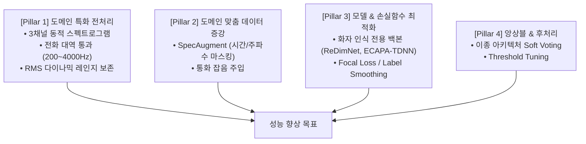

# [DCC Mission 2] 화자 분류 성능 향상 마스터 플랜 (초기 제안서)

> [!NOTE]
> **역사 및 초기 계획 문서 안내**: 본 문서는 2026-09-19 작성된 프로젝트 초기의 성능 개선 계획서(아이디어 제안서)입니다.
> 본 문서에 기재된 F1 93~95% 목표, 3채널 Delta, RMS 보존, 사후 임계값 튜닝 등은 탐색 단계의 제안이었으며,
> 실제 수행된 대조 실험, 최종 공식 선정 모델(3모델 균등 앙상블 92.46%) 및 결과는 [FINAL_EXPERIMENT_REPORT.md](FINAL_EXPERIMENT_REPORT.md)를 참조하십시오.

> **프로젝트**: 119 구급대원(상황실) vs 신고자 이진 화자 분류 (Speaker Classification)
> **초기 기준선**: ResNet-50 (약 90.0%)
> **초기 제안 목표**: 특화 전처리 + 경량 화자 전용 모델 + 앙상블을 통한 F1-Score 향상

---

## 1. 초기 도출 아이디어 요약

```
[구급대원 (Class 0)]           [신고자 (Class 1)]
• 평탄하고 일정한 피치         • 급격한 피치 요동 및 고음 피크
• 볼륨 편차 작음 (RMS Std)     • 볼륨 편차 큼 (RMS Std 기복)
• 명확한 포먼트 & 자음 (ZCR)   • 웅얼거림, 비명, 거친 호흡 혼재
• 정형화된 프로토콜 질문       • 고통/증상 호소, 말더듬, 무음
• 고정 헤드셋 마이크           • 스마트폰 핸드헬드/스피커폰
```

---

## 2. 초기 성능 향상 4대 제안 전략


```mermaid
graph TD
  A["[Pillar 1] 도메인 특화 전처리<br>• 3채널 동적 스펙트로그램<br>• 전화 대역 통과 (200~4000Hz)<br>• RMS 다이나믹 레인지 보존"] --> E["성능 향상 목표"]
  B["[Pillar 2] 도메인 맞춤 데이터 증강<br>• SpecAugment (시간/주파수 마스킹)<br>• 통화 잡음 주입"] --> E
  C["[Pillar 3] 모델 & 손실함수 최적화<br>• 화자 인식 전용 백본 (ReDimNet, ECAPA-TDNN)<br>• Focal Loss / Label Smoothing"] --> E
  D["[Pillar 4] 앙상블 & 후처리<br>• 이종 아키텍처 Soft Voting<br>• Threshold Tuning"] --> E
```

---

## 3. 계획의 실제 검증 현황 요약

- **특화 밴드패스 필터링**: 200~4,000Hz 밴드패스 FT 3에폭 대조 실험 결과, 기본 전처리 대비 성능 하락(-0.28%p ~ -0.50%p)이 확인되어 최종 파이프라인에서 배제하고 순정 전처리를 유지함.
- **화자 인식 전용 백본**: ReDimNet2-B2(91.75%)와 ECAPA-TDNN(92.05%)을 성공적으로 구축하여 핵심 백본으로 활용함.
- **최종 앙상블**: 3모델 균등 앙상블(92.46%) 및 2모델 경량 앙상블(92.42%)을 최종 후보로 확정함.
