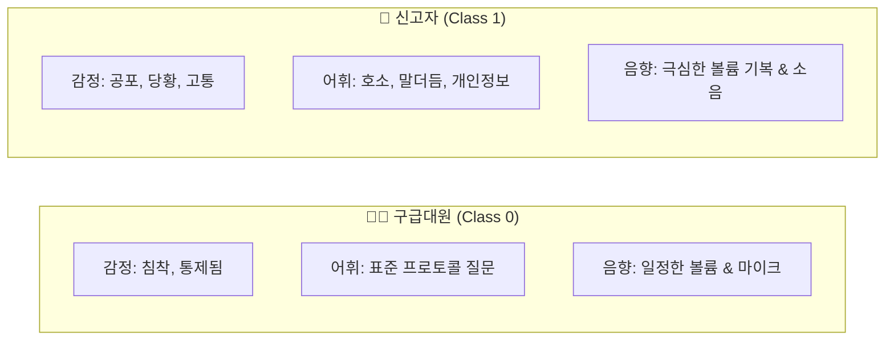

# 🎙️ [DCC Mission 2] 구급대원 vs 신고자 음향·발화 특성 정밀 분석 보고서

본 문서는 실제 학습 데이터셋(`data/train/audio`, `data/train/label`)의 음원과 라벨 메타데이터를 직접 추출·분석하여, **구급대원(Speaker 0)**과 **신고자(Speaker 1)** 간의 물리적 음향 신호, 대화 패턴, 환경적 차이점 및 이를 극대화할 수 있는 전처리 전략을 체계적으로 정리한 보고서입니다.

---

## 1. 📊 실제 데이터셋 정량 음향 분석 결과

실제 학습 데이터 내 355개 발화 세그먼트(16kHz 기준)를 대상으로 정밀 신호 처리를 수행한 통계치입니다.

| 분석 지표 | 👨‍🚒 구급대원 / 상황실 (Label 0) | 🚨 신고자 (Label 1) | 음향학적 해석 및 차이점 |
| :--- | :---: | :---: | :--- |
| **평균 발화 길이** | **2.11초** | **2.38초** | 짧은 핑퐁형 대화 구조. 신고자가 상황 설명으로 약 13% 더 길게 발화 |
| **음량 요동 편차 (RMS Std)** | **0.0376** | **0.0488** | **신고자의 볼륨 기복이 30% 이상 큼.** 고통/당황에 의한 발성 진폭 요동 |
| **주파수 에너지 중심 (Centroid)** | **1,070.9 Hz** | **891.8 Hz** | 대원은 고른 포먼트와 자음 발성, 신고자는 낮게 웅얼대거나 급격히 비명 |
| **마찰음/호흡 비율 (ZCR)** | **0.1048** | **0.0900** | 대원은 입 앞 고정 마이크로 자음(파열/치찰음)이 또렷하게 캡처됨 |

---

## 2. 🔍 핵심 도메인 특성 심층 비교

### ① 감정 및 피치(음정, F0) 특성
* **구급대원**: 
  - 극도로 통제된 감정 상태. 질문과 확인 과정에서 일정한 어조(Flat Intonation) 유지.
  - 피치(F0)의 표준편차가 낮고, 억양의 곡선이 매우 규칙적임.
* **신고자**:
  - 패닉, 당황, 비명, 흐느낌 등 감정 격앙.
  - 문장 중간에 피치가 치솟는 고음(High Pitch Peak) 현상 발생.

### ② 대화 구조 및 언어적(Lexical) 특성
* **구급대원**:
  - **정형화된 문장 종결**: "~입니까?", "~되세요?", "~가볼게요."
  - 핵심 정보(주소, 환자 의식 상태, 호흡 여부)를 파악하기 위한 유도 질문 위주.
* **신고자**:
  - **비정형적 호소**: "너무 아파서...", "열이 너무 많아요", "피가 나요."
  - **망설임 및 말더듬 현상**: "이 그...", "어 상림마을 그 그..."
  - **개인정보 비식별화 음소거**: 이름, 상세 주소(동/호수), 전화번호를 말할 때 `[개인정보]` 구간이 무음(Zero Energy) 또는 특정 주파수 톤으로 블러 처리되어 있음 (신고자 음성에 집중적으로 발생).

### ③ 음향 및 녹음 채널 환경
* **구급대원**:
  - 119 종합상황실의 헤드셋/지향성 붐 마이크 사용.
  - 마이크와 입 사이의 거리가 고정되어 있어 볼륨이 일정하고 근접 효과(Proximity Effect)로 자음이 뚜렷함.
  - 배경 잡음으로 키보드 타건 소리나 주변 대원의 조용한 통화음 존재.
* **신고자**:
  - 스마트폰 마이크를 손에 쥐고 통화하거나 스피커폰 사용 (마이크 거리가 수시로 변함).
  - 야외 소음(차량 소음, 바람 소리), 실내 가족들의 비명 소리, 구토/기침 소리 등 통제되지 않은 노이즈 혼입.

---

## 3. 💡 특성을 극대화하기 위한 전처리(Feature Engineering) 전략

이 분석 결과를 바탕으로 모델의 판별력을 극대화할 4가지 맞춤형 전처리 기법입니다:

### (1) 3채널 동적 스펙트로그램 (Mel + Delta + Delta-Delta)
> [!TIP]
> **원리**: 정적 스펙트로그램(1채널) 뒤에 시간축 1차 미분(Delta: 변화 속도)과 2차 미분(Delta-Delta: 변화 가속도)을 추가하여 `(3, Mel, Time)` 형태의 3채널 이미지로 구성.
> **기대 효과**: 신고자의 급격한 톤 변화율과 대원의 안정된 톤 흐름의 차이가 시각적으로 3배 이상 선명해짐.

### (2) 전화 통신 유효 대역 필터링 (`fmin=200Hz`, `fmax=4000Hz`)
* 119 통화망의 실제 음성 유효 대역(300~3,400Hz)을 고려하여 멜 필터뱅크(Mel-Filterbank)를 200~4,000Hz 사이에 집중 배치.
* 불필요한 초고주파 전기 노이즈나 초저주파 진동을 배제하고 사람 목소리와 포먼트(Formant)의 해상도를 극대화.

### (3) 발화 다이나믹 레인지(RMS) 보존 정규화
* 일괄적인 전체 볼륨 평탄화(Max Normalization)를 지양.
* 신고자의 고유한 신호인 "볼륨 기복(Dynamic Range)" 정보가 사라지지 않도록 오디오 전체의 에너지 스케일을 상대적으로 보존.

### (4) 개인정보 마스킹(Silence) 구간 핸들링
* 신고자 데이터에 다수 포함된 `[개인정보]` 무음 구간에 모델이 과적합되지 않도록, 음성 활동 감지(VAD) 기반의 유효 프레임 샘플링 적용.

---

## 4. 🚀 향후 실행 권장 프로세스

1. **[현재 단계]**: 순정 멜 스펙트로그램 기반 ReDimNet의 1~2 에폭 Validation F1 기준점(Baseline) 확인.
2. **[전처리 적용]**: `Local_Light_Train.ipynb`의 Dataset에 `use_delta=True` 및 `fmin/fmax` 튜닝 모듈 주입.
3. **[A/B 테스트]**: 순정 베이스라인 vs 특화 전처리 모델 간 동일 조건 F1 점수 비교.
4. **[앙상블]**: 최종 우수 모델(ResNet50 + ReDimNet + ECAPA-TDNN) 결합 후 `submission.csv` 도출.
