# Mission 3 최종 보고서

119 신고 대화문으로 아홉 가지 증상을 동시에 예측하는 다중 라벨 분류 문제다. 데이터를 본 뒤 KLUE-RoBERTa baseline을 만들고, 고정 임계값 0.5에서 클래스 불균형을 확인했다. 백본·손실·구조를 바꿔 보았으나 큰 이득은 없었고, 학습 손실에 양성 가중(pos_weight power=0.5)을 넣는 쪽이 Macro F1@0.5를 0.5967에서 0.6496까지 올렸다. Training만으로 학습한 TF-IDF를 0.3으로 섞으면 0.6536이 되었다. 네 시드 앙상블은 당시 0.6546으로 이득이 약 0.001이라 한때는 단일 시드도 검토했다. 이후 상담 문장에 맞춘 TAPT와 층별 학습률(LLRD)을 더해 네 시드+TF-IDF가 **0.6593**이 되었고, 추론은 fp32 **101~113초**에서 fp16 **42초**로 줄어 이 구성을 제출 모델로 선정했다.

아래에 나오는 점수는 모두 Validation 3,640건, **Macro F1@0.5**다. 클래스마다 다른 임계값으로 올린 옛 분석값은 제출 점수가 아니다.

---

## 1. 과제 정의 및 데이터 분석

Mission 3는 119 신고 통화의 **대화 텍스트**만 보고 환자 증상을 찾는다. 입력은 신고자와 상황실 발화의 `utterances[].text`를 공백으로 이은 본문이다. 화자, 시간, 주소 같은 메타데이터와 음성 파일은 쓰지 않는다.

출력은 아홉 개 증상이다. 고열, 구토, 두통, 복통, 어지러움, 열상, 오심, 전신쇠약, 호흡곤란. 한 통화에 증상이 여러 개일 수 있어 **다중 라벨 분류**다.

Training 29,200건, Validation 3,640건. 평가는 증상별 F1의 평균인 Macro F1이다. 결정 임계값은 아홉 클래스 모두 **0.5**로 고정이다. 확률이 0.5 이상이면 그 증상이 있다고 본다.

```
119 신고 대화 TEXT
        ↓
      Model
        ↓
9개 symptom probability
        ↓
Threshold = 0.5
        ↓
다중 라벨 증상 예측

예시: "환자가 토하고 있고 배가 아파요"
복통 0.91 → 1
구토 0.87 → 1
오심 0.31 → 0
```

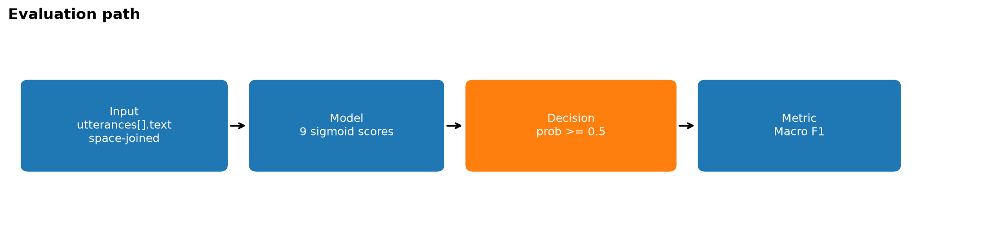
*<그림 1> 공식 평가 경로. 아홉 클래스 임계값 0.5, Macro F1.*

### 증상별 양성 샘플 수 (Training)

양성 수가 증상마다 다르다. 이 차이가 뒤에서 손실 가중(pos_weight)을 쓰게 된 이유다.

| 증상 | Training 양성 수 |
|---|---|
| 복통 | 6,771 |
| 어지러움 | 6,334 |
| 전신쇠약 | 5,310 |
| 고열 | 5,186 |
| 구토 | 4,463 |
| 호흡곤란 | 3,927 |
| 열상 | 3,465 |
| 오심 | 3,341 |
| 두통 | 2,905 |

오심은 전체의 11.4%다. 빈도만 보면 중간이지만, 뒤에서 보듯 0.5 기준 F1은 처음에 매우 낮았다.

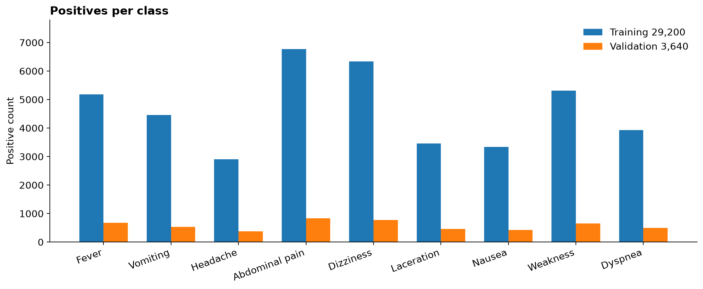
*<그림 2> 증상별 양성 샘플 수 (Training / Validation). 오심 Training 11.4%.*

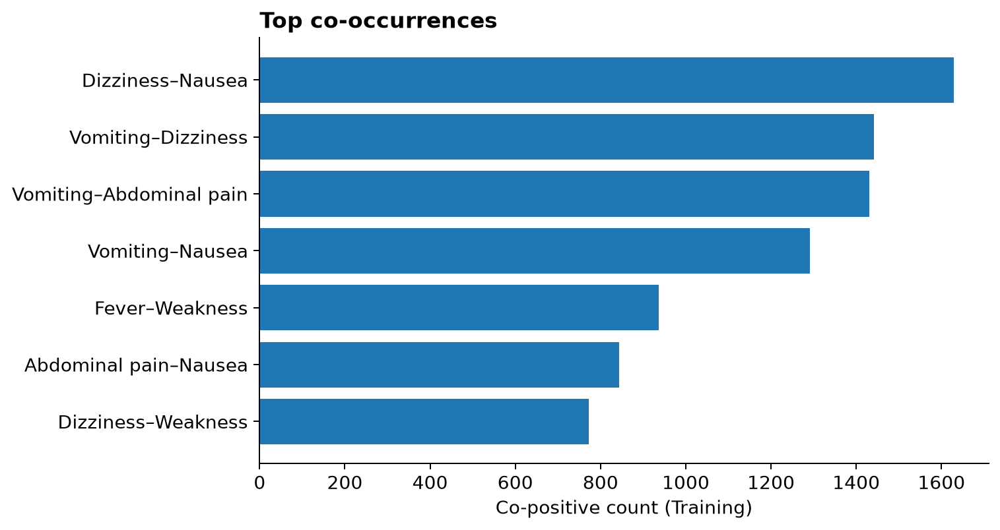
*<그림 3> Training 상위 동시출현 쌍.*

### 한 신고에 포함된 증상 수 (Training)

| 증상 개수 | 통화 수 |
|---|---|
| 1 | 19,560 |
| 2 | 7,137 |
| 3 | 2,161 |
| 4 | 325 |
| 5 | 17 |

평균 약 1.43개, 최대 5개다. 증상이 0개인 통화는 없다. 한 신고에 여러 증상이 같이 나오므로, 증상을 하나만 고르는 분류가 아니라 동시에 여러 개를 맞춰야 한다.

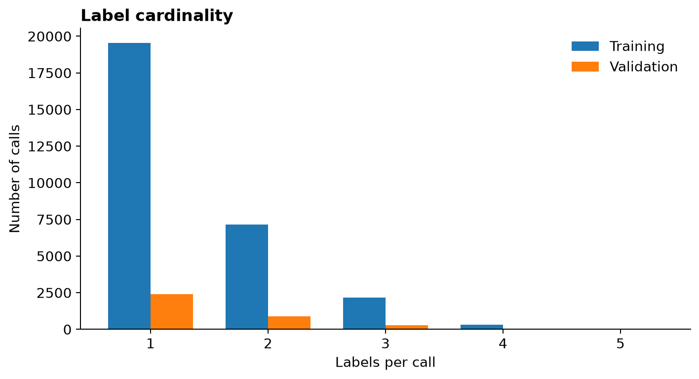
*<그림 4> 신고당 증상 개수. 평균 Training 1.43, Validation 1.44.*

### 텍스트 길이와 512 토큰

Validation 기준 문자 수 평균 468, 중앙값 427, 상위 5% 859, 최댓값 1,551. KLUE 토큰 중앙값 233, 상위 5% 463, 최댓값 807. **512를 넘는 통화는 98/3,640, 2.69%**다.

모델 입력은 max_length 512에서 앞을 남기고 자른다(truncate). 초과 비율이 작고, 뒤에서 앞뒤를 이어 붙이는 실험이 점수를 올리지 못해 이 설정을 유지했다.

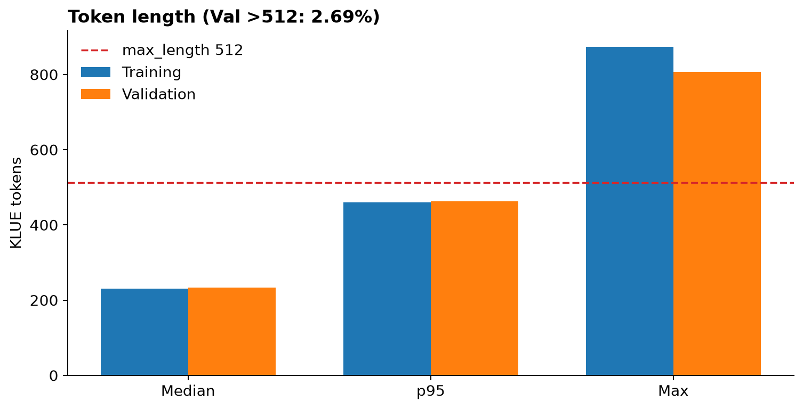
*<그림 5> KLUE 토큰 길이 요약. Validation에서 512 초과는 98건(2.69%).*

---

## 2. Baseline 구축 및 초기 문제 발견

처음부터 최종 모델을 만든 것이 아니라, baseline을 만들고 어디서 실패하는지 본 뒤 고쳤다.

처음 시도는 KoBERT였고 tokenizer가 맞지 않아 F1@0.5가 0이었다. 전용 tokenizer로 고친 뒤 0.5737이 나왔고, KoELECTRA를 거쳐 **KLUE-RoBERTa-base**를 기본 백본으로 두었다. 이후 개선 표의 기준선은 같은 환경에서 다시 학습한 KLUE + plain BCE다.

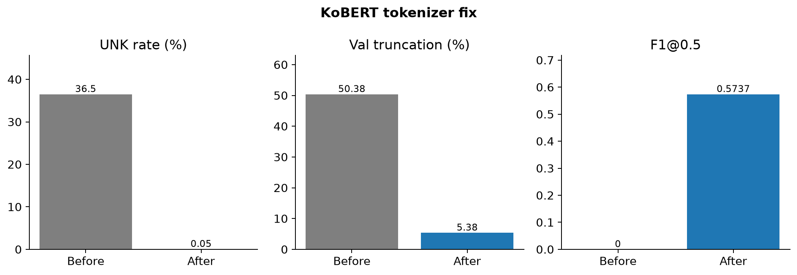
*<그림 6> KoBERT tokenizer 수정. F1@0.5 0 → 0.5737.*

```
Input text
  → KLUE-RoBERTa
  → Linear classification head
  → Sigmoid
  → 9 probabilities
  → threshold 0.5
```

| 설정 | Macro F1@0.5 | 오심 F1@0.5 |
|---|---|---|
| KLUE-RoBERTa + plain BCE | **0.5967** | **0.032** |

클래스별 F1@0.5 (plain BCE):

| 고열 | 구토 | 두통 | 복통 | 어지러움 | 열상 | 오심 | 전신쇠약 | 호흡곤란 |
|---|---|---|---|---|---|---|---|---|
| 0.687 | 0.588 | 0.518 | 0.815 | 0.645 | 0.882 | 0.032 | 0.546 | 0.660 |

전체 Macro만 보면 0.60 근처지만, 클래스별로 보면 열상·복통은 높고 **오심은 0.032**로 거의 잡히지 않는다. 고정 임계값 0.5에서 일부 증상의 양성 예측이 충분히 이루어지지 않는다는 신호다. 오심 하나만으로 전체를 설명할 수는 없고, 두통·전신쇠약도 상대적으로 낮다. 다만 오심의 하락 폭이 가장 커서 이후 실험의 출발점이 되었다.

---

## 3. 초기 모델 및 구조 개선 실험

KLUE 하나만 돌린 것이 아니라, 백본과 손실·구조를 바꿔 고정 0.5에서 점수가 오르는지 확인했다. 비교는 모두 Macro F1@0.5다. 예전에 쓰던 클래스별 최적 임계값 점수는 여기에 섞지 않는다.

| 실험 | 목적 | Macro F1@0.5 | 판단 |
|---|---|---|---|
| KoBERT (tokenizer 수정) | 한국어 baseline | 0.5737 | KLUE로 이동 |
| KoELECTRA-base | 더 강한 encoder | 0.5811 | 미채택 |
| KLUE-RoBERTa-base | 성능·비용 | 0.6003 (재현 0.5967) | 백본 채택 |
| KF-DeBERTa-base | 더 큰 encoder | 0.6061 | 파라미터 186M, 이득 대비 비용 |
| ASL | 쉬운 음성 완화 | 0.5293 | 미채택 |
| Pure-nausea sampling | 단독 오심 보강 | 0.5855 (기본 0.6003) | 미채택 |
| Label-wise attention | 증상별 증거 | 0.5941 | 미채택 |
| Label dependency 손실 | 동시출현 | 0.5981 | 미채택 |
| Pairwise ranking | 양성>음성 순위 | 0.5979 | 미채택 |
| 학습률 1e-5 | 안정성 | 0.5963 | 미채택 |
| [SEP] 결합 | 발화 경계 | 0.6464 (공백 0.6496) | 공백 결합 유지 |
| head-tail / sliding | 512 절단 복구 | truncate 대비 하락 또는 동등 | truncate 유지 |

백본을 KLUE에서 KF나 large로 바꿔도 F1@0.5의 이득은 작거나 비용이 컸다. 손실·attention·샘플링은 공식 0.5에서 일관된 큰 개선을 주지 못했다. **구조를 키우는 것만으로는 고정 임계값 성능이 잘 오르지 않았다.** 그래서 다음은 클래스 불균형을 학습 손실에 직접 넣는 쪽으로 갔다.

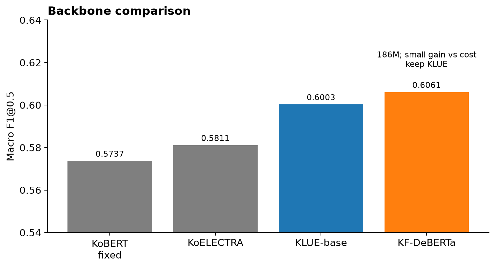
*<그림 7> 백본별 Macro F1@0.5. 제출 백본은 KLUE-RoBERTa-base.*

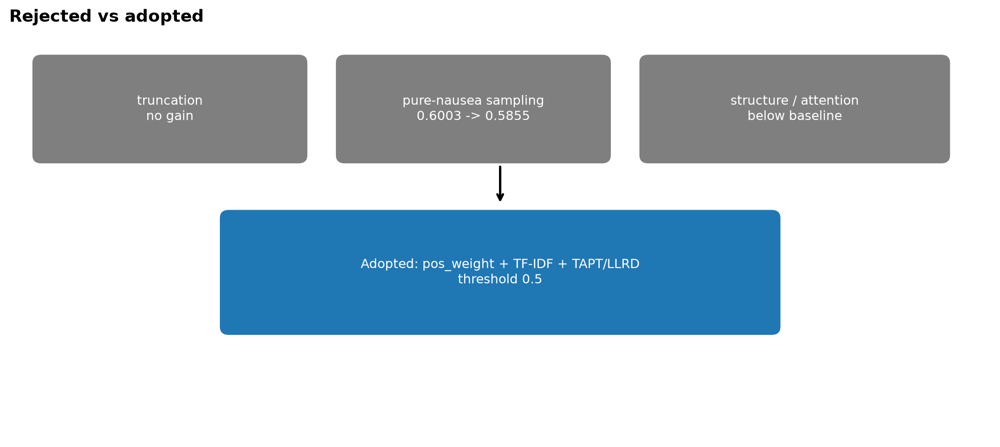
*<그림 8> 초기 가설 실험 흐름.*

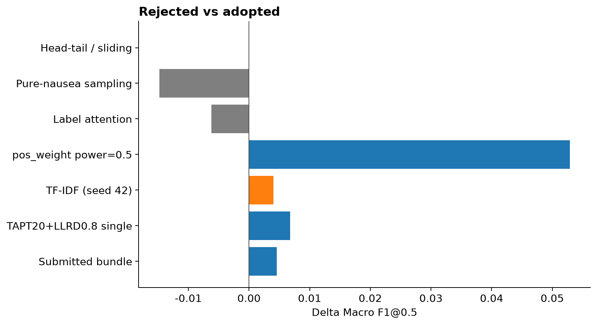
*<그림 9> 기각과 채택. 공식 지표는 F1@0.5.*

---

## 4. 핵심 개선 — Class imbalance 대응

초기에는 backbone이나 모델 구조를 변경하는 방향을 먼저 검토했지만, Validation 결과를 클래스별로 확인했을 때 문제의 핵심은 특정 클래스가 고정 임계값 0.5에서 충분히 양성으로 예측되지 않는 데 있다고 판단했다. 최종 제출에서는 클래스별 threshold 조정이 불가능했기 때문에, 추론 단계에서 임계값을 변경하는 대신 학습 단계에서 양성 label의 손실 기여도를 조절하는 방향으로 접근했다. 이에 `BCEWithLogitsLoss`에 `pos_weight`를 적용하고 그 강도를 비교했다.

```
pos_weight = (negative / positive) ** power
```

power=1.0은 비를 그대로 곱한다. power=0.5는 제곱근이라 보정이 더 완만하다.

| 설정 | Macro F1@0.5 | 오심 F1@0.5 |
|---|---|---|
| Plain BCE | 0.5967 | 0.032 |
| pos_weight power=1.0 | 0.6189 | 0.363 |
| pos_weight power=0.5 | **0.6496** | **0.387** |

Macro는 plain 대비 **+0.0529**다. power=1은 오심을 많이 살리지만 고열·구토·두통 등 다른 클래스가 내려갔다. power=0.5는 오심도 올리고 **아홉 클래스 F1이 모두** plain보다 높다.

| | 고열 | 구토 | 두통 | 복통 | 어지러움 | 열상 | 오심 | 전신쇠약 | 호흡곤란 |
|---|---|---|---|---|---|---|---|---|---|
| Plain | 0.687 | 0.588 | 0.518 | 0.815 | 0.645 | 0.882 | 0.032 | 0.546 | 0.660 |
| power=0.5 | 0.689 | 0.590 | 0.555 | 0.819 | 0.659 | 0.884 | 0.387 | 0.590 | 0.673 |

시드 42~45에서 power=0.5 Macro는 0.6453~0.6496, 평균 0.6475다. 특정 클래스 하나 때문에 Macro만 오른 것이 아니라, 불균형을 완만하게 반영한 손실이 0.5 작동점 전반을 끌어올렸다.

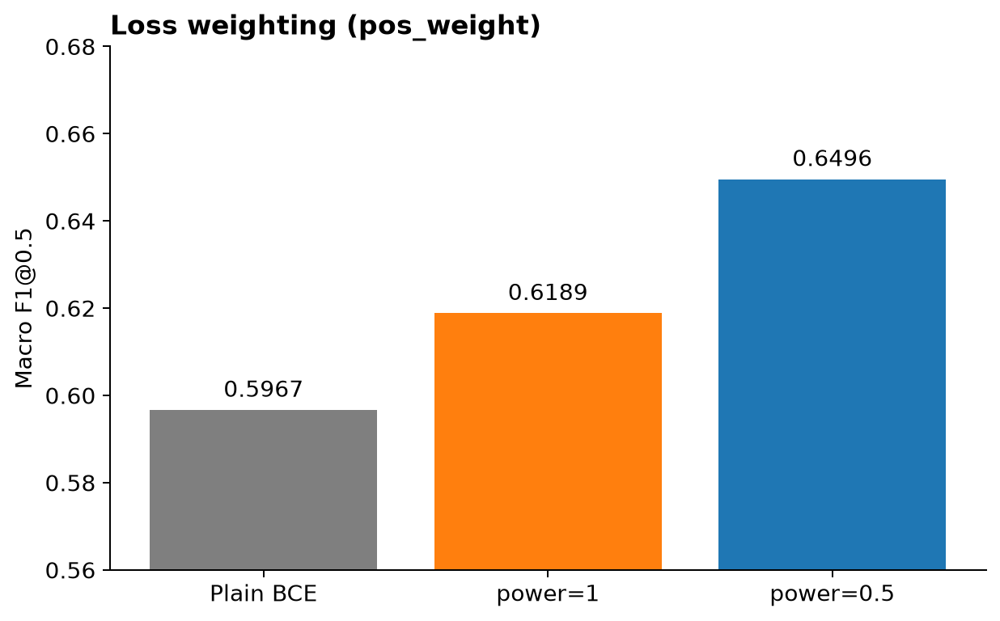
*<그림 10> pos_weight 강도별 Macro F1@0.5. 가장 큰 이득은 power=0.5.*

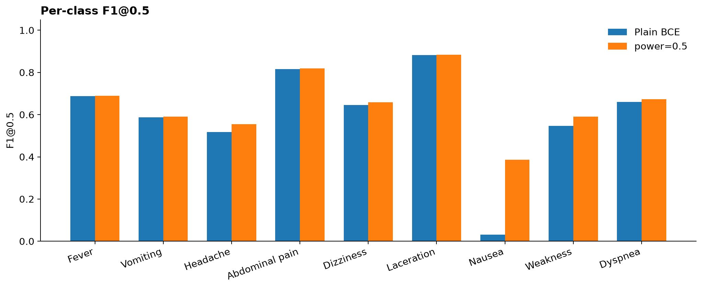
*<그림 11> 클래스별 F1@0.5. power=0.5는 아홉 클래스 모두 개선.*

---

## 5. TF-IDF 보조 모델 도입

pos_weight로 큰 폭의 개선을 얻은 뒤에는 Transformer 구조를 계속 복잡하게 변경하기보다, Transformer와 다른 방식으로 텍스트를 보는 모델이 남은 오류를 보완할 수 있는지를 고민했다. KLUE-RoBERTa는 문맥과 의미를 중심으로 처리하는 반면, 상담 문장에는 ‘메스껍다’, ‘울렁’, ‘토할 것 같다’처럼 짧은 문자·단어 패턴 자체가 증상의 단서가 되는 경우가 있다. 이에 서로 다른 표현 방식을 보완적으로 활용하기 위해 Training 데이터만으로 TF-IDF와 로지스틱 회귀 기반 보조 모델을 추가로 학습했다.

설정: 문자 n-gram 2~4(`char_wb`), 단어 n-gram 1~2, Logistic Regression, C=0.15, class_weight=balanced. **제공된 Training만 fit**한다. Validation은 변환과 평가에만 쓴다. 외부 데이터는 없다.

```
                ┌→ KLUE-RoBERTa → 확률 × 0.7 ─┐
119 TEXT ───────┤                              ├→ 최종 확률 → 0.5 → 9 labels
                └→ TF-IDF + LR  → 확률 × 0.3 ─┘
```

| 설정 | Macro F1@0.5 |
|---|---|
| KLUE + pos_weight power=0.5 (seed 42) | 0.6496 |
| 위 + TF-IDF 0.3 | **0.6536** |

향상은 **+0.0040**이다. 시드 43·44·45에서도 혼합이 모두 올랐다. 임계값은 그대로 0.5다. TF-IDF 가중 0.3은 아홉 클래스에 공통인 스칼라 하나다.

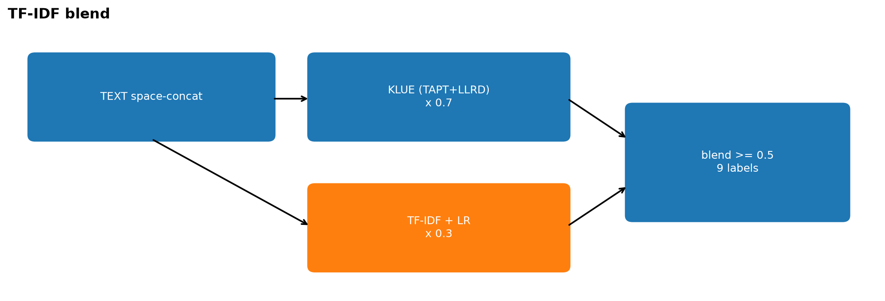
*<그림 12> Transformer 0.7 + TF-IDF 0.3. 판정은 다시 0.5.*

---

## 6. 앙상블 검토, 그리고 제출 모델 선정

TF-IDF를 붙인 뒤 시드 평균도 보았다.

| 후보 | Macro F1@0.5 | Transformer 수 |
|---|---|---|
| Single seed 42 + TF-IDF | 0.6536 | 1 |
| 4-seed + TF-IDF (TAPT 이전) | 0.6546 | 4 |

당시에는 single seed 42 + TF-IDF가 0.6536, 4-seed + TF-IDF가 0.6546으로 성능 차이가 약 +0.001에 불과했다. (당시 추론 시간은 단일 모델 약 42초 대비 4시드 fp32가 101~113초였다.) 따라서 Transformer를 1개에서 4개로 늘리는 것에 비해 성능 이득이 작다고 판단하여, 이 단계에서는 single seed 42 + TF-IDF를 제출 후보로 검토했다.

앞선 실험에서 여러 backbone과 모델 구조 변경도 검토했지만 개선폭은 제한적이었다. 이에 모델의 크기나 구조를 추가로 복잡하게 만드는 것보다, 사전학습 모델인 KLUE-RoBERTa를 실제 119 상담 텍스트에 더 잘 적응시키고 fine-tuning 과정에서 기존 표현을 안정적으로 보존하는 방향을 검토했다. 이를 위해 Training 본문을 이용한 TAPT와 layer별 learning rate를 다르게 적용하는 LLRD를 실험했다.

먼저, KLUE-RoBERTa에서 Training 상담 텍스트의 MLM loss가 약 5.0~5.1 수준으로 관찰되었다. 이 값 자체를 domain gap의 직접적인 증거로 해석하지 않고, 실제 task의 상담 텍스트에 추가 적응시키는 것이 도움이 되는지 확인하기 위해 Training 본문만을 이용하여 MLM을 20 epoch 이어 학습했다(TAPT). Validation 문장은 손실을 확인하는 데만 사용하고 가중치 갱신에는 사용하지 않았다.

분류 학습에서는 층을 내려갈수록 학습률을 0.8배씩 줄였다(LLRD). 학습률만 키운 실험은 점수가 오르지 않았고, 층마다 다르게 준 쪽에서 이득이 났다. TAPT 20 epoch + LLRD 0.8은 **기존 KLUE 시드 평균 0.6475** 대비 같은 시드끼리 **+0.0068**이었고 시드 42~45가 모두 올랐다(++++). LLRD 0.9도 네 시드가 모두 올랐지만(++++), 짝 비교는 **+0.0029**다.

이 네 모델에 TF-IDF 0.3을 섞으면 Validation Macro F1@0.5는 **0.6593**이다. RTX 5060 8GB에서 Validation 3,640건을 추론한 결과, 긴 문장 우선 배치로 GPU 예비 메모리를 약 4.5GB에서 0.9GB로 줄였고, FP16을 적용하여 추론 시간을 FP32 **101~113초**에서 **약 42초**로 단축했다. 가중치를 평균해 한 번만 추론하는 model soup 방식은 0.6503으로 성능이 낮아 채택하지 않았다.

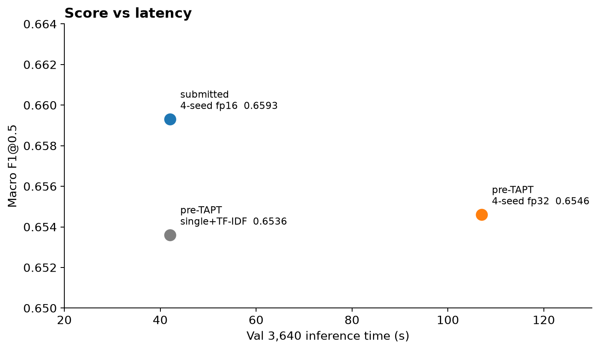
*<그림 13> 점수와 추론 시간. 제출은 0.6593, fp16 약 42초.*

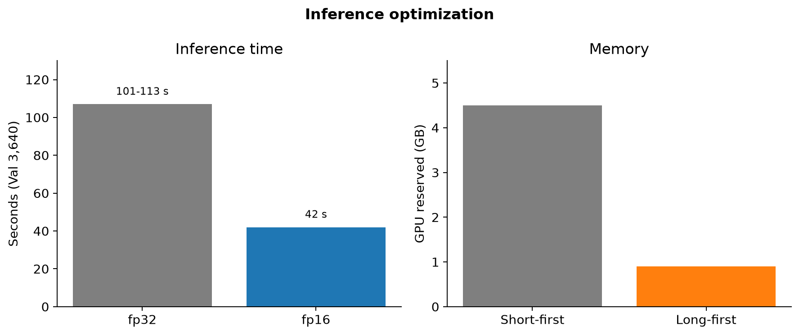
*<그림 14> 추론 최적화. fp32 101~113초 → fp16 약 42초.*

| | TAPT 이전 single+TF-IDF | TAPT 이전 4-seed | **제출 (TAPT+LLRD 4-seed+TF-IDF)** |
|---|---|---|---|
| Macro F1@0.5 | 0.6536 | 0.6546 | **0.6593** |
| Transformer 수 | 1 | 4 | 4 |
| 추론 (Val 3,640) | fp16 약 42초 | fp32 101~113초 | **fp16 약 42초** |
| 제출 복잡도 | 낮음 | 높음 | 번들 4개+TF-IDF, 로컬 로드 |

**선정.** TAPT 이전에는 단일 시드가 비용 대비 나았다. 이후에는 네 시드가 점수에서 앞서고, fp16으로 **101~113초 → 42초**가 되어 **TAPT 20 + LLRD 0.8 + seed 42~45 + TF-IDF 0.3 + 임계값 0.5**를 제출했다.

최종 제출 후보 A/B/C (4-seed + TF-IDF, Δ는 기존 KLUE 0.6475 대비):

| | A. LLRD 0.9 | **B. TAPT20+LLRD0.8 (제출)** | C. TAPT 20ep |
|---|---|---|---|
| 단일 평균 | 0.6504 | **0.6543** | 0.6516 |
| 짝 비교 | +0.0029 ++++ | **+0.0068 ++++** | +0.0041 ++++ |
| 번들 | 0.6596 | **0.6593** | 0.6589 |

**B를 최종 제출로 선정한 이유:** 후보 A(LLRD 0.9)도 네 시드 모두 향상(++++)되었고 번들 점수는 0.6596으로 점만 보면 조금 더 높다. 하지만 단일 모델의 짝 비교 개선폭은 B가 **+0.0068**로 A(+0.0029)보다 2배 이상 크다. 번들 점수 0.0003의 차이는 통계적 신뢰구간이 겹치는 미세한 차이인 반면, 4개 시드 전반에서 가장 일관되고 큰 개선을 입증한 조합이 B이므로 **TAPT 20 + LLRD 0.8 번들(0.6593)**을 최종 제출 모델로 선정했다. (추론 멤버 수는 셋 모두 4개로 동일)

---

## 7. 전체 실험 흐름 요약

대표 단계만 한 줄로 이으면 아래와 같다.

| 단계 | Macro F1@0.5 |
|---|---|
| Plain BCE | 0.5967 |
| pos_weight power=1.0 | 0.6189 |
| pos_weight power=0.5 | 0.6496 |
| + TF-IDF (seed 42) | 0.6536 |
| 4-seed + TF-IDF (TAPT 전) | 0.6546 |
| TAPT+LLRD 후 4-seed + TF-IDF | **0.6593** |

Baseline → 불균형 대응 → 가중 강도 조절 → 다른 표현(TF-IDF) 결합 → 앙상블 검토 → 도메인 적응(TAPT/LLRD) → 추론 효율 → 제출. 모델을 무작위로 바꾼 것이 아니라, 0.5에서 안 잡히던 문제를 따라가며 단계를 쌓았다.

가장 큰 한 칸은 pos_weight power=0.5(+0.0529)다. TF-IDF와 TAPT는 그 위의 보완이다.

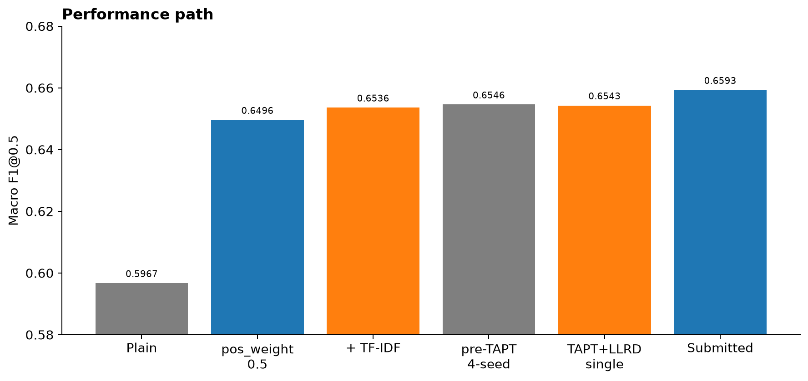
*<그림 15> Validation Macro F1@0.5 흐름. 제출 끝점은 0.6593.*

---

## 8. Error analysis

점수를 올린 뒤에도 모델이 어디서 놓치는지를 보았다. 아래 False Negative 비율은 **초기 KLUE plain 모델**을, 당시 분석에 쓰던 클래스별 임계값 기준으로 집계한 결과다. 최종 0.5 제출 모델에서 같은 비율을 다시 잰 표는 아니다. 다만 “증상이 많을수록 일부를 놓친다”는 경향을 보는 자료로 쓴다.

실제 증상 개수에 따른 FN rate (초기 baseline 분석, 최종 모델 아님):

| True label 수 | FN rate |
|---|---|
| 1 | 23.15% |
| 2 | 39.79% |
| 3 | 44.29% |
| 4 이상 | 57.84% |

한 신고에 실제 증상이 많을수록 놓치는 비율이 높아진다. 다중 라벨에서 여러 증거를 한 표현으로 모으는 일이 남은 과제다.

단독일 때와 다른 증상과 같이 있을 때 재현율(같은 분석):

| 증상 | 단독 recall | 동시 출현 recall |
|---|---|---|
| 호흡곤란 | 77.85% | 44.32% |
| 고열 | 77.88% | 55.75% |
| 두통 | 53.69% | 40.44% |

복합 증상에서 일부를 놓치는 패턴과 맞는다. 오심은 반대로 단독보다 동시 출현일 때 재현율이 더 높았다.

---

## 9. 채택하지 않은 접근

안 된 실험도 기록해 두었기 때문에 최종 구조가 단순 CLS + 손실 가중 + TF-IDF + TAPT인 이유가 분명하다. 대표만 적는다.

| 실험 | 가설 | 결과 | 판단 |
|---|---|---|---|
| [SEP] 결합 | 발화 경계를 토큰으로 | 0.6496 대비 −0.0033 | 미채택 |
| ASL | 불균형·쉬운 음성 | F1@0.5 0.5293 | 미채택 |
| Label attention | 증상별 표현 | 0.6003 → 0.5941 | 미채택 |
| Sampling | 단독 오심 보강 | 0.6003 → 0.5855 | 미채택 |
| KF-DeBERTa | 더 큰 백본 | 0.6061, 이후에도 이득 제한 | 미채택 |
| TAPT 이전 4-seed | 시드 분산 | +0.001, 당시 비용 큼 | 당시 미채택 → TAPT 후 fp16으로 채택 |
| Model soup | 가중치 평균 1회 추론 | 0.6503 | 미채택 |
| 클래스별 임계값 | 클래스별 최적 threshold 분석 | 약 0.655 (분석용), 규정상 0.5 고정 | 미사용 |

오심만 따로 두는 헤드, 라벨 스무딩, hard negative도 시험했으나 순위 지표가 오르지 않아 본 모델에 넣지 않았다.

---

## 10. 제출 모델과 계산 효율

**제출 구성**

- Backbone: KLUE-RoBERTa-base, Training 상담 본문 MLM 20 epoch (TAPT)
- Loss: BCEWithLogitsLoss, pos_weight = (음성/양성)^0.5
- Fine-tune: LLRD 0.8, 최상위 학습률 5e-5
- Seed: 42, 43, 44, 45 균등 평균
- 보조: TF-IDF + Logistic Regression, Training only, 혼합 0.3
- 판정: 아홉 클래스 모두 0.5
- 추론: `ensemble.json`의 fp16 (CUDA), 긴 문장 우선 배치

| 항목 | 값 |
|---|---|
| Model | TAPT KLUE-RoBERTa ×4 + TF-IDF/LR |
| Total / Active params | 445,681,425 / 445,681,425 (`ckpt/` 실측: 110,625,033×4 + TF-IDF 3,181,293) |
| GPU | NVIDIA GeForce RTX 5060 8GB |
| Inference batch | 16 |
| Validation | 3,640 |
| Validation 추론 시간 | fp32 **101~113초**, fp16 **약 42초** |
| Threshold | 0.5 fixed |
| Macro F1@0.5 | **0.6593** |

KLUE 하나당 약 110,625,033, 네 개와 TF-IDF 로지스틱(약 3.18M)을 합친 값이다. 네 멤버를 매 샘플에 모두 쓰므로 total과 active가 같다.

---

## 11. 제출 및 재현성

- `inference.py` 한 번 실행으로 결과 CSV를 만든다.
- tokenizer, config, 가중치는 `ckpt/`에 두고 로컬에서만 로드한다. 추론 시 인터넷이 필요 없다.
- `requirements.txt`, `model_train.ipynb`를 제공한다.
- TF-IDF/LR의 fit에는 Training 데이터만 사용하며, Validation은 모델 및 설정 선택과 최종 성능 평가에 사용한다.
- 결정 임계값은 코드에서 0.5로 고정한다.

```
Evaluation JSON
      ↓
 inference.py
      ↓
Local TAPT KLUE ×4 ──┐
                     ├→ 0.7/0.3 blend
Local TF-IDF/LR ─────┘
      ↓
threshold 0.5
      ↓
mission3.csv
```

출력 열은 `label file name`, `symptom`이다. 저장소 루트에서 돌릴 때는 출력 파일명에 `mission3`이 있어야 한다.

학습 순서: CSV 생성 → TAPT → 시드별 분류 학습 → TF-IDF → 번들 복사.

---

## 12. 결론 및 한계

1. Plain BCE baseline의 Macro F1@0.5는 0.5967이고, 오심은 0.032였다.
2. pos_weight power=0.5로 0.6496까지 올렸고, 아홉 클래스가 모두 개선되었다.
3. Training-only TF-IDF를 섞어 seed 42 기준 0.6536이 되었다.
4. TAPT 이전 네 시드+TF-IDF는 당시 4-seed 번들 0.6546으로, 당시 single 0.6536 대비 +0.001이었다. 이후 TAPT+LLRD 네 시드+TF-IDF가 **0.6593**(기존 4-seed 번들 대비 +0.0046)이고, 추론은 **101~113초 → 42초**가 되어 이 구성을 제출했다.
5. 모든 클래스의 결정 임계값은 규정대로 0.5다.

### 한계 1 — 복합 증상에서 False Negative

초기 분석에서 실제 증상 수가 1개일 때 FN 23.15%, 4개 이상일 때 57.84%였다. 여러 증상이 한 신고에 있을 때 일부를 놓치는 경향이 있다. 최종 제출 모델에서 같은 비율을 다시 집계하지는 않았다.

### 한계 2 — 일부 증상의 표현과 라벨

오심·구토 오류를 살펴보면, 텍스트에 오심을 시사하는 말이 있어도 오심 라벨이 없는 경우가 있다. 개인정보와 통화 ID는 적지 않는다.

| 실제 라벨 | 대화 표현 유형 | 관찰 |
|---|---|---|
| 오심 0, 구토 1 | “토할 것 같은…” | 오심 쪽으로 읽히기 쉬움 |
| 오심 0, 구토 1 | “속이 미식거리고…” | 위와 같음 |
| 오심 0, 구토 1 | “속이 울렁울렁…” | 위와 같음 |

오심과 구토의 기준이 겹치거나, 구토가 있으면 오심 라벨이 빠지거나, 구어 표현이 애매할 수 있다. **일부 사례의 사후 분석**이며, 데이터 전체가 잘못되었다고 보지 않는다.

명시적 표현(메스껍, 울렁, 토할 것 등)이 오심 양성의 일부에만 나타난다. 간접 표현, 전사 다양성, 문맥으로만 추론되는 경우와 함께 봐야 한다. 라벨 오류의 증명이 아니라, 이 증상이 텍스트만으로 어려운 이유에 대한 정황이다.

### 한계 3 — 일반화

모델 선택은 제공된 Training/Validation 기준이다. 보지 못한 평가 집합에서 같은 향상이 나온다고 보장하지 않는다. 0.6593은 Validation 결과다.

여러 모델이 같이 틀리는 **공통 실패 사례가 상당수** 있다. 주호소만 라벨하는 관례, 통화 텍스트에 없는 정보로 붙은 양성 가능성은 열어 둔다.

본 과제에서는 공식 평가 기준인 Macro F1@0.5를 기준으로 모델을 최적화했으며, 실제 서비스 적용 시에는 증상별 위험도와 False Negative 비용을 별도로 고려할 필요가 있다.
